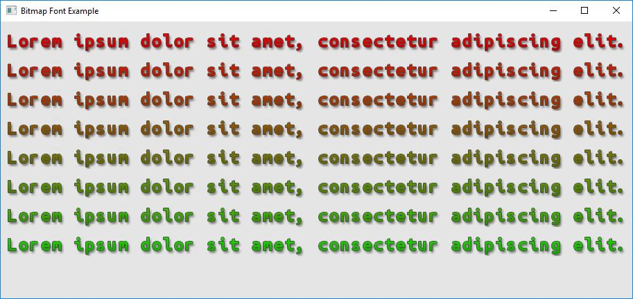

Example: Bitmap Font
=================

The purpose of this example is to show capability of loading and rendering a bitmap based font. It's up to the user how they decide to load and fill character data. The code below should be simple enough to understand. Similary to [True Type Font](md_doc_markdown_example-true-type-font.html), this example uses an image instead of an True Type fonts.

**Requires finegraphics and finemath module to run**

The following texture is used (in RAW format) as a bitmap font:

<pre>
#include &lt;<a href="">ffw/graphics.h</a>&gt;
#include &lt;fstream&gt;
#include &lt;cstring&gt;
#define NUM_OF_LINES (8)
#define TEXTURE_SIZE (512*512*4)

// There values are extracted from the image ubuntu-mono-rgba8.raw
#define CHAR_WIDTH 24
#define CHAR_HEIGHT 30
#define CHAR_ADVANCE 16
#define CHAR_BEARING 23

static unsigned char pixels[TEXTURE_SIZE];

class App: public <a href="ffw_GLFWRenderWindow.html">ffw::GLFWRenderWindow</a> &#123;
public:
    App()&#123;
    &#125;

    ~App()&#123;
    &#125;

    bool <a href="ffw_GLFWRenderWindow.html#68554ce1">setup</a>() override &#123;
        std::cout &lt;&lt; "Window setup!" &lt;&lt; std::endl;

        // Load ubuntu-mono-rgba8.raw image
        // We use *.RAW format for the purpose of the example
        std::ifstream input("ubuntu-mono-rgba8.raw", std::ios::in | std::ios::binary);
        if(!input) &#123;
            std::cerr &lt;&lt; "Failed to open 'ubuntu-mono-rgba8.raw' File is missing?" &lt;&lt; std::endl;
            return false;
        &#125;

        // Check file size
        input.seekg(0, std::ios::end);
        size_t size = (size_t)input.tellg();
        if(size != TEXTURE_SIZE) &#123;
            std::cerr &lt;&lt; "File 'ubuntu-mono-rgba8.raw' has wrong size! Expected 512x512 pixels RGB_ALPHA_8888!" &lt;&lt; std::endl;
            return false;
        &#125;

        memset(pixels, 0xCC, TEXTURE_SIZE);

        // Load pixels
        input.seekg(0, std::ios::beg);
        input.read((char*)pixels, TEXTURE_SIZE);

        // Load font 28pt at 72 DPI
        // Chars starting from 0 to 255
        if(!font.createFromData(this, pixels, 512, 512, <a href="ffw_ImageType.html#3a8727be">ffw::ImageType::RGB_ALPHA_8888</a>, 28, 72, 0, 255))&#123;
            std::cerr &lt;&lt; "Failed to create font from pixel data!" &lt;&lt; std::endl;
            return false;
        &#125;

        // Fill data
        // Since the font is mono (Ubuntu Mono Regular) then all characters have the same data!
        // It is up to the user how the data is filled. There is no prefered container/data set!
        for(int i = 0; i &lt; 256; i++) &#123;
            int y = i / 16;
            int x = i - (y * 16);
            auto&amp; chr = font.setCharData((wchar_t)i);
            chr.x = x * 32;
            chr.y = y * 32;
            chr.width = CHAR_WIDTH;
            chr.height = CHAR_HEIGHT;
            chr.advance = CHAR_ADVANCE;
            chr.bearingX = 0;
            chr.bearingY = CHAR_BEARING;
        &#125;

        // Required for font blending
        glEnable(GL_BLEND);
        glBlendFunc(GL_SRC_ALPHA, GL_ONE_MINUS_SRC_ALPHA);

        // Background color
        glClearColor(0.9f, 0.9f, 0.9f, 1.0f);

        return true;
    &#125;

    void <a href="ffw_GLFWRenderWindow.html#93db1d16">render</a>() override &#123;
        glClear(GL_COLOR_BUFFER_BIT | GL_DEPTH_BUFFER_BIT);

        int height = 0;
        for(int i = 0; i &lt; NUM_OF_LINES; i++)&#123;
            this-&gt;<a href="ffw_RenderContext.html#6b8df6af">setDrawColor</a>(<a href="ffw.html#e71e7885">ffw::rgb</a>(255 - i*(256 / NUM_OF_LINES), i*(256 / NUM_OF_LINES), 0));
            this-&gt;<a href="ffw_RenderContext.html#a583cfdb">drawString</a>(10, 10 + height, &amp;font, "Lorem ipsum dolor sit amet, consectetur adipiscing elit.");
            // Line height is a simple formula of (height * weight)
            // wehre height is the height of the font
            // and weight is line spacing (1.0 and more)
            height += int(font.getSizePixels() * 1.5f);
        &#125;
    &#125;

    void <a href="ffw_GLFWRenderWindow.html#eb5dbf50">close</a>() override &#123;
        std::cout &lt;&lt; "Window is closing!" &lt;&lt; std::endl;
        font.destroy();
    &#125;

    void <a href="ffw_GLFWRenderWindow.html#d1e6b4ff">windowCloseEvent</a>() override &#123;
        std::cout &lt;&lt; "Window close button pressed!" &lt;&lt; std::endl;
        this-&gt;<a href="ffw_GLFWRenderWindow.html#f26e03bc">shouldClose</a>(true);
    &#125;

private:
    <a href="ffw_BitmapFont.html">ffw::BitmapFont</a> font;
&#125;;

int main(int argc, char *argv[])&#123;
    // Instance to our app class
    App app;

    // set arguments
    <a href="ffw_GLFWRenderWindowArgs.html">ffw::GLFWRenderWindowArgs</a> args;
    args.<a href="ffw_GLFWRenderWindowArgs.html#427706b8">size</a>.<a href="ffw_Vec2.html#e49a9b9e">set</a>(800, 400);
    args.<a href="ffw_GLFWRenderWindowArgs.html#b1b7d616">title</a> = "Bitmap Font Example";

    // create window
    if(!app.create(args, NULL))&#123;
        std::cerr &lt;&lt; "Failed to create window!" &lt;&lt; std::endl;
        return 1;
    &#125;

    // Run setup
    if(!app.setup())&#123;
        std::cerr &lt;&lt; "Failed to setup window!" &lt;&lt; std::endl;
        system("pause");
        return 1;
    &#125;

    // The main window loop
    while(app.shouldRender())&#123;
        app.renderFrame();
        app.poolEvents();
    &#125;

    // destroy window, this will delete all graphics data used by the window.
    // Must be called after the setup and before the graphics
    // is terminated
    app.destroy();
&#125;

</pre>

 

