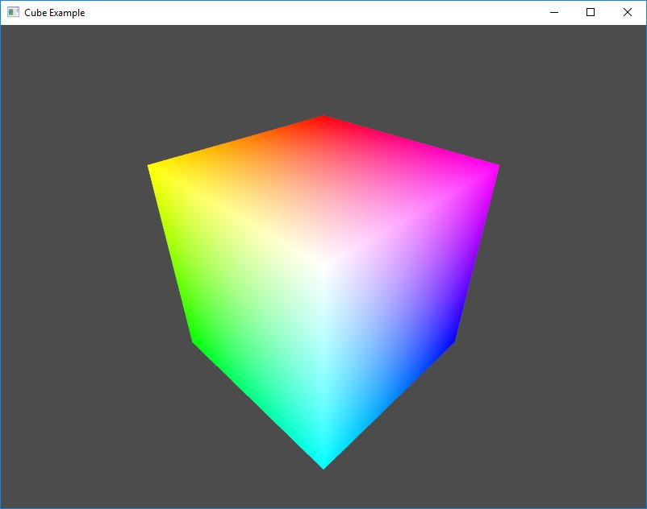

Example: Cube
=================

The purpose of this example is to show capability of rendering a very simple 3D object on the screen using OpenGL. The code shows how to easily create model view and projection matrices and some of the other vector operations.

**Requires finegraphics and finemath module to run**

<pre>
#include &lt;<a href="">ffw/graphics.h</a>&gt;
#include &lt;<a href="">ffw/math.h</a>&gt;

#define EYES_DEFAULT_POS 1.7f, 1.7f, 1.7f
#define STRINGIFY(x) #x

static const std::string vertexShaderCode = "#version 130\n" STRINGIFY(
in vec3 position;
in vec3 color;

out vec3 out_color;

uniform mat4 model;
uniform mat4 view;
uniform mat4 projection;

void main() &#123;
    out_color = color;
    gl_Position = projection * view * model * vec4(position, 1.0f);
&#125;
);

static const std::string fragmentShaderCode = "#version 130\n" STRINGIFY(
in vec3 out_color;
void main() &#123;
    gl_FragColor = vec4(out_color, 1.0f);
&#125;
);

static const float cubeVertices[] = &#123;
    -1.0f, -1.0f, -1.0f, 0.0f, 0.0f, 0.0f,
    -1.0f, -1.0f,  1.0f, 0.0f, 1.0f, 0.0f,
     1.0f, -1.0f,  1.0f, 0.0f, 1.0f, 1.0f,
     1.0f, -1.0f, -1.0f, 0.0f, 0.0f, 1.0f,

    -1.0f, -1.0f, -1.0f, 0.0f, 0.0f, 0.0f,
    -1.0f,  1.0f, -1.0f, 1.0f, 0.0f, 0.0f,
     1.0f,  1.0f, -1.0f, 1.0f, 0.0f, 1.0f,
     1.0f, -1.0f, -1.0f, 0.0f, 0.0f, 1.0f,

    -1.0f, -1.0f,  1.0f, 0.0f, 1.0f, 0.0f,
    -1.0f,  1.0f,  1.0f, 1.0f, 1.0f, 0.0f,
    -1.0f,  1.0f, -1.0f, 1.0f, 0.0f, 0.0f,
    -1.0f, -1.0f, -1.0f, 0.0f, 0.0f, 0.0f,

    -1.0f, -1.0f,  1.0f, 0.0f, 1.0f, 0.0f,
     1.0f, -1.0f,  1.0f, 0.0f, 1.0f, 1.0f,
     1.0f,  1.0f,  1.0f, 1.0f, 1.0f, 1.0f,
    -1.0f,  1.0f,  1.0f, 1.0f, 1.0f, 0.0f,

     1.0f, -1.0f,  1.0f, 0.0f, 1.0f, 1.0f,
     1.0f, -1.0f, -1.0f, 0.0f, 0.0f, 1.0f,
     1.0f,  1.0f, -1.0f, 1.0f, 0.0f, 1.0f,
     1.0f,  1.0f,  1.0f, 1.0f, 1.0f, 1.0f,

     1.0f,  1.0f, -1.0f, 1.0f, 0.0f, 1.0f,
     1.0f,  1.0f,  1.0f, 1.0f, 1.0f, 1.0f,
    -1.0f,  1.0f,  1.0f, 1.0f, 1.0f, 0.0f,
    -1.0f,  1.0f, -1.0f, 1.0f, 0.0f, 0.0f,
&#125;;

class App : public <a href="ffw_GLFWRenderWindow.html">ffw::GLFWRenderWindow</a> &#123;
public:
    App() &#123;
        mouseDown = false;
        mouseOld = 0;
        eyesRot = 0;
    &#125;

    ~App() &#123;
    &#125;

    bool <a href="ffw_GLFWRenderWindow.html#68554ce1">setup</a>() override &#123;
        // Check if graphics components are compatible with OpenGL
        if (!<a href="ffw_BufferObject.html#a098027f">ffw::Vbo::checkCompability</a>(this)) &#123;
            std::cerr &lt;&lt; "OpenGL used on this machine is too old! Vbo is not compatible!" &lt;&lt; std::endl; return false;
        &#125;
        if (!<a href="ffw_Shader.html#8e08f5b2">ffw::Shader::checkCompability</a>(this)) &#123;
            std::cerr &lt;&lt; "OpenGL used on this machine is too old! Shader is not compatible!" &lt;&lt; std::endl; return false;
        &#125;

        // Load shader
        try &#123;
            shader.createFromData(this, "", vertexShaderCode, fragmentShaderCode);
        &#125;
        catch (std::exception&amp; e) &#123;
            // Error while loading shader
            std::cerr &lt;&lt; "Failed to create shader!" &lt;&lt; std::endl &lt;&lt; e.what() &lt;&lt; std::endl;
            return false;
        &#125;

        vbo.create(this, cubeVertices, sizeof(cubeVertices), GL_STATIC_DRAW);

        eyesPos.set(EYES_DEFAULT_POS);

        // This is not the most efficient way to calculate 
        // Model-View-Projection
        // We are doing it this way just for the purpose
        // of the example...

        // get the aspect ratio of the window
        <a href="ffw_Vec2.html">ffw::Vec2i</a> windowSize = this-&gt;<a href="ffw_GLFWRenderWindow.html#70919473">getSize</a>();
        float aspectRatio = windowSize.<a href="ffw_Vec2.html#b2ccd122">x</a> / float(windowSize.<a href="ffw_Vec2.html#370d6d90">y</a>);
        // create the projection matrix
        // 60 deg field of view
        // 0.1 near distance of frustum
        // 1000.0 far distance of frustum
        projectionMatrix = <a href="ffw.html#c6652302">ffw::makeProjectionMatrix</a>(60.0f, aspectRatio, 0.05f, 1000.0f);

        // set the view matrix
        //viewMatrix = ffw::Mat4x4f(1.0f);
        viewMatrix = <a href="ffw.html#c9109de4">ffw::makeLookAtMatrix</a>(eyesPos, <a href="ffw_Vec3.html">ffw::Vec3f</a>(0.0f, 0.0f, 0.0f), <a href="ffw_Vec3.html">ffw::Vec3f</a>(0.0f, 1.0f, 0.0f));

        // set the model matrix
        modelMatrix = <a href="ffw.html#029b468c">ffw::Mat4x4f</a>(1.0f);

        glEnable(GL_BLEND);
        glBlendFunc(GL_SRC_ALPHA, GL_ONE_MINUS_SRC_ALPHA);
        glEnable(GL_DEPTH_TEST);
        glClearColor(0.3f, 0.3f, 0.3f, 1.0f);

        return true;
    &#125;

    void <a href="ffw_GLFWRenderWindow.html#93db1d16">render</a>() override &#123;
        glClear(GL_COLOR_BUFFER_BIT | GL_DEPTH_BUFFER_BIT);
        // Begin shader program
        shader.bind();
        // bind cube object
        vbo.bind();
        // set uniforms and attribute pointers
        // set the position attribute to length 3 starting at position 0 in the vertex buffer
        // Each vertex has 8 floats total: &#123;Px, Py, Pz, Nx, Ny, Nz, U, V&#125;
        // Where P is position, N is normal and UV are texture coordinates
        shader.setAttributePointerf(shader.getAttributeLocation("position"), 3, 6 * sizeof(float), (void*)(0 * sizeof(float)));
        // set the normal attribute to length 3 starting at position 3 in the vertex buffer
        shader.setAttributePointerf(shader.getAttributeLocation("color"), 3, 6 * sizeof(float), (void*)(3 * sizeof(float)));
        // set the model, view and projection matrices
        shader.setUniformMatrix4fv(shader.getUniformLocation("model"), &amp;modelMatrix[0], 1);
        shader.setUniformMatrix4fv(shader.getUniformLocation("view"), &amp;viewMatrix[0], 1);
        shader.setUniformMatrix4fv(shader.getUniformLocation("projection"), &amp;projectionMatrix[0], 1);
        // draw whole object
        shader.drawArrays(GL_QUADS, 0, vbo.getSize() / sizeof(float) / 6); // 6 floats per one vertex
        // Stop object shader
        shader.unbind();
        vbo.unbind();
    &#125;

    void <a href="ffw_GLFWRenderWindow.html#eb5dbf50">close</a>() override &#123;
        shader.destroy();
        vbo.destroy();
    &#125;

    void <a href="ffw_GLFWRenderWindow.html#707e5f61">textInputEvent</a>(unsigned int C) override &#123;

    &#125;

    void <a href="ffw_GLFWRenderWindow.html#ce25f297">keyPressedEvent</a>(<a href="ffw.html#23661d50">ffw::Key</a> key, <a href="ffw.html#e03b52d5">ffw::Mode</a> mode) override &#123;
    &#125;

    void <a href="ffw_GLFWRenderWindow.html#eaa1a6c6">mouseMovedEvent</a>(int mousex, int mousey) override &#123;
        if (mouseDown) &#123;
            int diffx = mousex - mouseOld.x;
            int diffy = mousey - mouseOld.y;
            mouseOld.x = mousex;
            mouseOld.y = mousey;

            eyesRot.x += -diffx/2;
            eyesRot.y += -diffy/2;

            eyesPos.set(EYES_DEFAULT_POS);
            eyesPos.rotateY(eyesRot.x);

            // get penpedicular vector
            <a href="ffw_Vec3.html">ffw::Vec3f</a> axis((float)eyesPos.z, 0.0f, (float)-eyesPos.x);

            axis.normalize();

            //std::cout &lt;&lt; "axis: " &lt;&lt; axis &lt;&lt; std::endl;
            eyesPos.rotateByAxis(eyesRot.y, axis);

            viewMatrix = <a href="ffw.html#c9109de4">ffw::makeLookAtMatrix</a>(eyesPos, <a href="ffw_Vec3.html">ffw::Vec3f</a>(0.0f, 0.0f, 0.0f), <a href="ffw_Vec3.html">ffw::Vec3f</a>(0.0f, 1.0f, 0.0f));
        &#125;
        else &#123;
            mouseOld.x = mousex;
            mouseOld.y = mousey;
        &#125;
    &#125;

    void <a href="ffw_GLFWRenderWindow.html#fbe7329a">mouseScrollEvent</a>(int scroll) override &#123;
    &#125;

    void <a href="ffw_GLFWRenderWindow.html#1e8d2373">mouseButtonEvent</a>(<a href="ffw.html#f80e46cc">ffw::MouseButton</a> button, <a href="ffw.html#e03b52d5">ffw::Mode</a> mode) override &#123;
        if (mode == <a href="ffw_Mode.html#0d56c1de">ffw::Mode::PRESSED</a>)mouseDown = true;
        else mouseDown = false;
    &#125;

    void <a href="ffw_GLFWRenderWindow.html#e4b39662">windowResizedEvent</a>(int width, int height) override &#123;
        // Get the aspect ratio of the window
        float aspectRatio = width / float(height);
        // create the projection matrix
        // 60 deg field of view
        // 0.1 near distance of frustum
        // 1000.0 far distance of frustum
        projectionMatrix = <a href="ffw.html#c6652302">ffw::makeProjectionMatrix</a>(60.0f, aspectRatio, 0.05f, 1000.0f);
    &#125;

    void <a href="ffw_GLFWRenderWindow.html#e57c71a5">windowMovedEvent</a>(int windowx, int windowy) override &#123;
    &#125;

    void <a href="ffw_GLFWRenderWindow.html#727ce05e">windowFocusEvent</a>(bool focus) override &#123;
    &#125;

    void <a href="ffw_GLFWRenderWindow.html#d1e6b4ff">windowCloseEvent</a>() override &#123;
        this-&gt;<a href="ffw_GLFWRenderWindow.html#f26e03bc">shouldClose</a>(true);
    &#125;

    void <a href="ffw_GLFWRenderWindow.html#c02a201a">filesDroppedEvent</a>(std::vector&lt;std::string&gt; filelist) override &#123;
    &#125;
private:
    <a href="ffw_Shader.html">ffw::Shader</a> shader;
    <a href="ffw_Vbo.html">ffw::Vbo</a> vbo;

    // Model, view and projection matrices used in shader
    <a href="ffw_Mat4x4.html">ffw::Mat4x4f</a> projectionMatrix;
    <a href="ffw_Mat4x4.html">ffw::Mat4x4f</a> viewMatrix;
    <a href="ffw_Mat4x4.html">ffw::Mat4x4f</a> modelMatrix;

    <a href="ffw_Vec3.html">ffw::Vec3f</a> eyesPos;
    bool mouseDown;
    <a href="ffw_Vec2.html">ffw::Vec2i</a> mouseOld;
    <a href="ffw_Vec2.html">ffw::Vec2f</a> eyesRot;
&#125;;

int main(int argc, char *argv[]) &#123;
    // Instance to our app class
    App app;

    // set arguments
    <a href="ffw_GLFWRenderWindowArgs.html">ffw::GLFWRenderWindowArgs</a> args;
    args.<a href="ffw_GLFWRenderWindowArgs.html#427706b8">size</a>.<a href="ffw_Vec2.html#e49a9b9e">set</a>(800, 600);
    args.<a href="ffw_GLFWRenderWindowArgs.html#b1b7d616">title</a> = "Cube Example";
    args.<a href="ffw_GLFWRenderWindowArgs.html#17443f00">samples</a> = 4;

    // create window
    if (!app.create(args, NULL)) &#123;
        std::cerr &lt;&lt; "Failed to create window!" &lt;&lt; std::endl;
        return 1;
    &#125;

    // Run setup
    if (!app.setup()) &#123;
        std::cerr &lt;&lt; "Failed to setup window!" &lt;&lt; std::endl;
        return 1;
    &#125;

    // The main window loop
    while (app.shouldRender()) &#123;
        app.renderFrame();
        app.waitForEvents();
    &#125;

    // destroy window, this will delete all graphics data used by the window.
    // Must be called after the setup and before the graphics
    // is terminated
    app.destroy();
    return 0;
&#125;

</pre>

 

