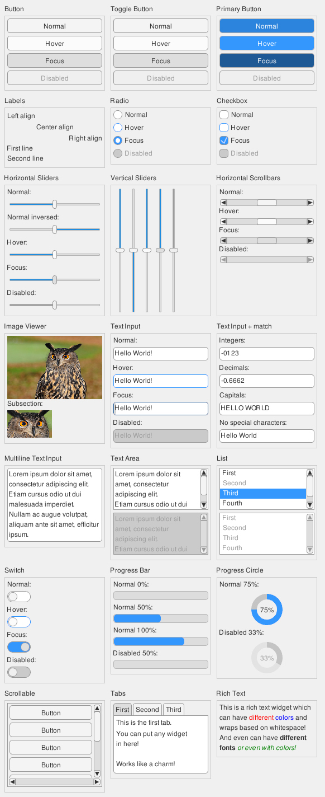
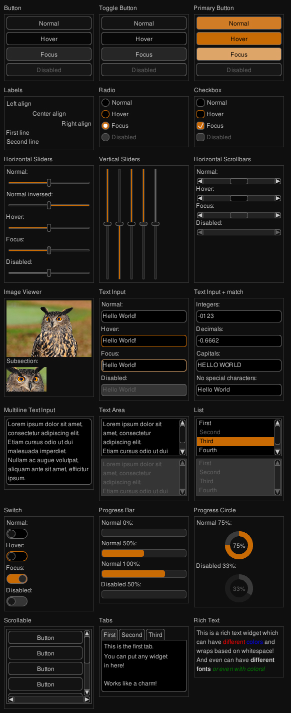
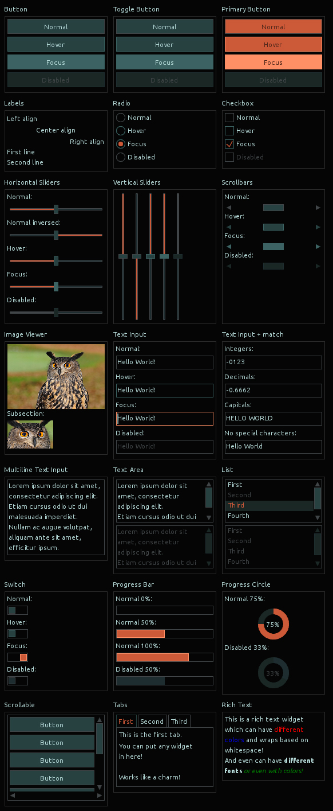
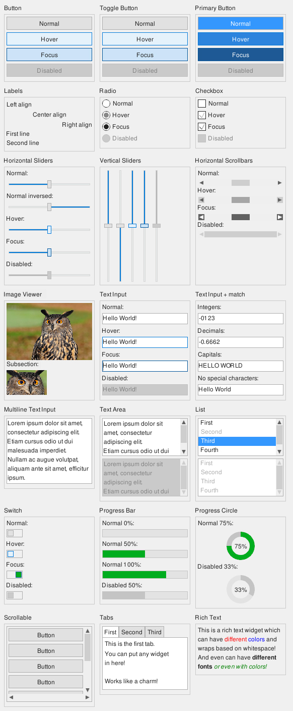

Example: Gui Themes
=================

The GUI widgets are all following stylistic design defined by [ffw::GuiStyleGroup](ffw_GuiStyleGroup.html) which are then grouped together by [ffw::GuiTheme](ffw_GuiTheme.html). The user is free to define they own theme, or edit pre-defined one. The following themes are defined in finegui:

**Simple Light, created based on the Ubuntu user interface:**

Can be enabled by `gui.setTheme(&ffw::GuiTheme::simpleLight);` where `gui` is instance of [ffw::GuiWindow](ffw_GuiWindow.html)

**Simple Dark, exactly same as Simple Light, except all colors are inverted:**

Can be enabled by `gui.setTheme(&ffw::GuiTheme::simpleDark);` where `gui` is instance of [ffw::GuiWindow](ffw_GuiWindow.html)

**Modern Flat theme:**

Can be enabled by `gui.setTheme(&ffw::GuiTheme::modernFlat);` where `gui` is instance of [ffw::GuiWindow](ffw_GuiWindow.html)

**Windows like theme:**

Can be enabled by `gui.setTheme(&ffw::GuiTheme::windows);` where `gui` is instance of [ffw::GuiWindow](ffw_GuiWindow.html)

 

