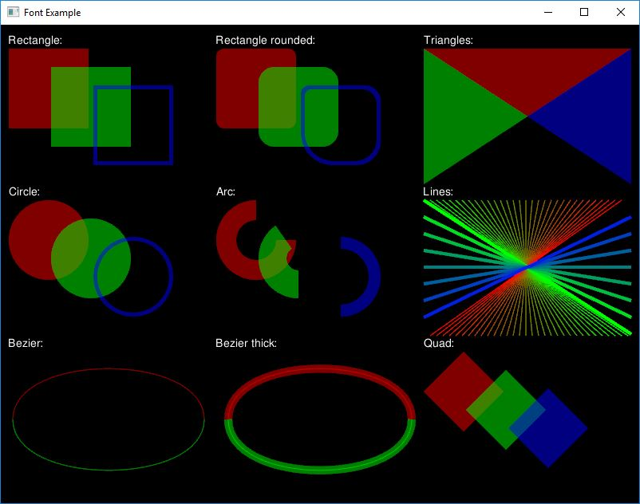

Example: Shapes
=================

The purpose of this example is to show various 2D primitives included in graphics module.

**Requires finegraphics and finemath module to run**

<pre>
#include &lt;<a href="">ffw/graphics.h</a>&gt;
#include &lt;<a href="">math.h</a>&gt;

inline int RandomRange(int min, int max) &#123;
    return (std::rand() % (max - min)) + min;
&#125;
    

class App : public <a href="ffw_GLFWRenderWindow.html">ffw::GLFWRenderWindow</a> &#123;
public:
    App() &#123;
    &#125;

    ~App() &#123;
    &#125;

    bool <a href="ffw_GLFWRenderWindow.html#68554ce1">setup</a>() override &#123;
        if (!font.createFromFile(this, "FreeSans.ttf", 14, 72)) &#123;
            std::cerr &lt;&lt; "Failed to create font from: \'FreeSans.ttf\' File is missing?" &lt;&lt; std::endl;
            return false;
        &#125;

        glEnable(GL_BLEND);
        glBlendFunc(GL_SRC_ALPHA, GL_ONE_MINUS_SRC_ALPHA);

        return true;
    &#125;

    void <a href="ffw_GLFWRenderWindow.html#93db1d16">render</a>() override &#123;
        //glPolygonMode(GL_FRONT_AND_BACK, GL_LINE);
        glClear(GL_COLOR_BUFFER_BIT | GL_DEPTH_BUFFER_BIT);

        this-&gt;<a href="ffw_RenderContext.html#6b8df6af">setDrawColor</a>(<a href="ffw.html#e71e7885">ffw::rgb</a>(0xFFFFFF)); // White color
        this-&gt;<a href="ffw_RenderContext.html#9279a9aa">setOutlineMode</a>(false);
        this-&gt;<a href="ffw_RenderContext.html#7acd1170">setOutlineSize</a>(1);
        //this-&gt;drawRectangleRounded(10, 10, 800 - 20, 600 - 20, 10, 20, 30, 40, 32);
        //return;

        this-&gt;<a href="ffw_RenderContext.html#a583cfdb">drawString</a>(10 + 0, 10, &amp;font, "Rectangle:");
        this-&gt;<a href="ffw_RenderContext.html#a583cfdb">drawString</a>(10 + 260, 10, &amp;font, "Rectangle rounded:");
        this-&gt;<a href="ffw_RenderContext.html#a583cfdb">drawString</a>(10 + 520, 10, &amp;font, "Triangles:");

        this-&gt;<a href="ffw_RenderContext.html#a583cfdb">drawString</a>(10 + 0, 10 + 190, &amp;font, "Circle:");
        this-&gt;<a href="ffw_RenderContext.html#a583cfdb">drawString</a>(10 + 260, 10 + 190, &amp;font, "Arc:");
        this-&gt;<a href="ffw_RenderContext.html#a583cfdb">drawString</a>(10 + 520, 10 + 190, &amp;font, "Lines:");

        this-&gt;<a href="ffw_RenderContext.html#a583cfdb">drawString</a>(10 + 0, 10 + 380, &amp;font, "Bezier:");
        this-&gt;<a href="ffw_RenderContext.html#a583cfdb">drawString</a>(10 + 260, 10 + 380, &amp;font, "Bezier thick:");
        this-&gt;<a href="ffw_RenderContext.html#a583cfdb">drawString</a>(10 + 520, 10 + 380, &amp;font, "Quad:");

        // Rectangles
        this-&gt;<a href="ffw_RenderContext.html#6b8df6af">setDrawColor</a>(<a href="ffw.html#efcb64d9">ffw::rgba</a>(0xFF000080));
        this-&gt;<a href="ffw_RenderContext.html#e04aedbb">drawRectangle</a>(10, 30, 100, 100);
        this-&gt;<a href="ffw_RenderContext.html#6b8df6af">setDrawColor</a>(<a href="ffw.html#efcb64d9">ffw::rgba</a>(0x00FF0080));
        this-&gt;<a href="ffw_RenderContext.html#e04aedbb">drawRectangle</a>(10 + 53, 30 + 23, 100, 100);
        this-&gt;<a href="ffw_RenderContext.html#6b8df6af">setDrawColor</a>(<a href="ffw.html#efcb64d9">ffw::rgba</a>(0x0000FF80));
        this-&gt;<a href="ffw_RenderContext.html#9279a9aa">setOutlineMode</a>(true);
        this-&gt;<a href="ffw_RenderContext.html#7acd1170">setOutlineSize</a>(5);
        this-&gt;<a href="ffw_RenderContext.html#e04aedbb">drawRectangle</a>(10 + 106, 30 + 46, 100, 100);
        this-&gt;<a href="ffw_RenderContext.html#9279a9aa">setOutlineMode</a>(false);

        // Rounded rectangles
        this-&gt;<a href="ffw_RenderContext.html#6b8df6af">setDrawColor</a>(<a href="ffw.html#efcb64d9">ffw::rgba</a>(0xFF000080));
        this-&gt;<a href="ffw_RenderContext.html#651eec48">drawRectangleRounded</a>(10 + 260, 30, 100, 100, 10, 10, 10, 10);
        this-&gt;<a href="ffw_RenderContext.html#6b8df6af">setDrawColor</a>(<a href="ffw.html#efcb64d9">ffw::rgba</a>(0x00FF0080));
        this-&gt;<a href="ffw_RenderContext.html#651eec48">drawRectangleRounded</a>(10 + 260 + 53, 30 + 23, 100, 100, 20, 20, 20, 20);
        this-&gt;<a href="ffw_RenderContext.html#6b8df6af">setDrawColor</a>(<a href="ffw.html#efcb64d9">ffw::rgba</a>(0x0000FF80));
        this-&gt;<a href="ffw_RenderContext.html#9279a9aa">setOutlineMode</a>(true);
        this-&gt;<a href="ffw_RenderContext.html#651eec48">drawRectangleRounded</a>(10 + 260 + 106, 30 + 46, 100, 100, 10, 20, 30, 40);
        this-&gt;<a href="ffw_RenderContext.html#9279a9aa">setOutlineMode</a>(false);

        // Triangles
        this-&gt;<a href="ffw_RenderContext.html#6b8df6af">setDrawColor</a>(<a href="ffw.html#efcb64d9">ffw::rgba</a>(0xFF000080));
        this-&gt;<a href="ffw_RenderContext.html#79fc47bb">drawTriangle</a>(10 + 520, 30,
                                       10 + 520 + 260, 30,
                                       10 + 520 + 260/2, 30 + 170/2);
        this-&gt;<a href="ffw_RenderContext.html#6b8df6af">setDrawColor</a>(<a href="ffw.html#efcb64d9">ffw::rgba</a>(0x00FF0080));
        this-&gt;<a href="ffw_RenderContext.html#79fc47bb">drawTriangle</a>(10 + 520, 30, 
                                       10 + 520 + 260 / 2, 30 + 170 / 2,
                                       10 + 520, 30 + 170);
        this-&gt;<a href="ffw_RenderContext.html#6b8df6af">setDrawColor</a>(<a href="ffw.html#efcb64d9">ffw::rgba</a>(0x0000FF80));
        this-&gt;<a href="ffw_RenderContext.html#79fc47bb">drawTriangle</a>(10 + 520 + 260, 30,
                                       10 + 520 + 260 / 2, 30 + 170 / 2,
                                       10 + 520 + 260, 30 + 170);

        // Circles
        this-&gt;<a href="ffw_RenderContext.html#6b8df6af">setDrawColor</a>(<a href="ffw.html#efcb64d9">ffw::rgba</a>(0xFF000080));
        this-&gt;<a href="ffw_RenderContext.html#a99be3f4">drawCircle</a>(60, 80 + 190, 50);
        this-&gt;<a href="ffw_RenderContext.html#6b8df6af">setDrawColor</a>(<a href="ffw.html#efcb64d9">ffw::rgba</a>(0x00FF0080));
        this-&gt;<a href="ffw_RenderContext.html#a99be3f4">drawCircle</a>(60 + 53, 80 + 190 + 23, 50);
        this-&gt;<a href="ffw_RenderContext.html#6b8df6af">setDrawColor</a>(<a href="ffw.html#efcb64d9">ffw::rgba</a>(0x0000FF80));
        this-&gt;<a href="ffw_RenderContext.html#9279a9aa">setOutlineMode</a>(true);
        this-&gt;<a href="ffw_RenderContext.html#a99be3f4">drawCircle</a>(60 + 106, 80 + 190 + 46, 50);
        this-&gt;<a href="ffw_RenderContext.html#9279a9aa">setOutlineMode</a>(false);

        // Arc
        this-&gt;<a href="ffw_RenderContext.html#6b8df6af">setDrawColor</a>(<a href="ffw.html#efcb64d9">ffw::rgba</a>(0xFF000080));
        this-&gt;<a href="ffw_RenderContext.html#df89b764">drawArc</a>(60 + 260, 80 + 190, 25, 50, 0.0, 270.0);
        this-&gt;<a href="ffw_RenderContext.html#6b8df6af">setDrawColor</a>(<a href="ffw.html#efcb64d9">ffw::rgba</a>(0x00FF0080));
        this-&gt;<a href="ffw_RenderContext.html#df89b764">drawArc</a>(60 + 260 + 53, 80 + 190 + 23, 15, 50, 90.0, 235.0);
        this-&gt;<a href="ffw_RenderContext.html#6b8df6af">setDrawColor</a>(<a href="ffw.html#efcb64d9">ffw::rgba</a>(0x0000FF80));
        this-&gt;<a href="ffw_RenderContext.html#df89b764">drawArc</a>(60 + 260 + 106, 80 + 190 + 46, 35, 50, -90.0, 90.0);

        // Lines
        this-&gt;<a href="ffw_RenderContext.html#7acd1170">setOutlineSize</a>(1);
        for (int i = 0; i &lt; 32; i++) &#123;
            this-&gt;<a href="ffw_RenderContext.html#6b8df6af">setDrawColor</a>(<a href="ffw.html#e71e7885">ffw::rgb</a>(i*8, 255 - i*8, 0));
            this-&gt;<a href="ffw_RenderContext.html#5bb70248">drawLine</a>(
                10 + 520 + i * (260 / 32), 30 + 190,
                10 + 520 + (32 - i) * (260 / 32), 30 + 190 + 170
            );
        &#125;

        this-&gt;<a href="ffw_RenderContext.html#7acd1170">setOutlineSize</a>(5);
        for (int i = 0; i &lt; 8; i++) &#123;
            this-&gt;<a href="ffw_RenderContext.html#6b8df6af">setDrawColor</a>(<a href="ffw.html#e71e7885">ffw::rgb</a>(0, 255 - i * 32, i * 32));
            this-&gt;<a href="ffw_RenderContext.html#5bb70248">drawLine</a>(
                10 + 520, 30 + 190 + (i) * (170 / 8),
                10 + 520 + 260, 30 + 190 + (8 - i) * (170 / 8)
            );
        &#125;

        // Bezier
        this-&gt;<a href="ffw_RenderContext.html#7acd1170">setOutlineSize</a>(1);
        this-&gt;<a href="ffw_RenderContext.html#6b8df6af">setDrawColor</a>(<a href="ffw.html#efcb64d9">ffw::rgba</a>(0xFF000080));
        this-&gt;<a href="ffw_RenderContext.html#b36a1802">drawBezier</a>(
            10 + 5,       30 + 380 + 85, // Start
            10 + 5,       30 + 380,      // CP 0
            10 + 250 - 5, 30 + 380,      // CP 1
            10 + 250 - 5, 30 + 380 + 85  // End
        );
        this-&gt;<a href="ffw_RenderContext.html#6b8df6af">setDrawColor</a>(<a href="ffw.html#efcb64d9">ffw::rgba</a>(0x00FF0080));
        this-&gt;<a href="ffw_RenderContext.html#b36a1802">drawBezier</a>(
            10 + 5, 30 + 380 + 85,       // Start
            10 + 5, 30 + 380 + 170,      // CP 0
            10 + 250 - 5, 30 + 380 + 170,// CP 1
            10 + 250 - 5, 30 + 380 + 85  // End
        );

        // Bezier thick
        this-&gt;<a href="ffw_RenderContext.html#7acd1170">setOutlineSize</a>(10);
        this-&gt;<a href="ffw_RenderContext.html#6b8df6af">setDrawColor</a>(<a href="ffw.html#efcb64d9">ffw::rgba</a>(0xFF000080));
        this-&gt;<a href="ffw_RenderContext.html#b36a1802">drawBezier</a>(
            10 + 270 + 5, 30 + 380 + 85, // Start
            10 + 270 + 5, 30 + 380,      // CP 0
            10 + 510 - 5, 30 + 380,      // CP 1
            10 + 510 - 5, 30 + 380 + 85  // End
        );
        this-&gt;<a href="ffw_RenderContext.html#6b8df6af">setDrawColor</a>(<a href="ffw.html#efcb64d9">ffw::rgba</a>(0x00FF0080));
        this-&gt;<a href="ffw_RenderContext.html#b36a1802">drawBezier</a>(
            10 + 270 + 5, 30 + 380 + 85, // Start
            10 + 270 + 5, 30 + 380 + 170,// CP 0
            10 + 510 - 5, 30 + 380 + 170,// CP 1
            10 + 510 - 5, 30 + 380 + 85  // End
        );

        // To compare thick bezier, we draw normal one on top of thick one
        this-&gt;<a href="ffw_RenderContext.html#7acd1170">setOutlineSize</a>(1);
        this-&gt;<a href="ffw_RenderContext.html#6b8df6af">setDrawColor</a>(<a href="ffw.html#efcb64d9">ffw::rgba</a>(0xFF000080));
        this-&gt;<a href="ffw_RenderContext.html#b36a1802">drawBezier</a>(
            10 + 270 + 5, 30 + 380 + 85, // Start
            10 + 270 + 5, 30 + 380,      // CP 0
            10 + 510 - 5, 30 + 380,      // CP 1
            10 + 510 - 5, 30 + 380 + 85  // End
        );
        this-&gt;<a href="ffw_RenderContext.html#6b8df6af">setDrawColor</a>(<a href="ffw.html#efcb64d9">ffw::rgba</a>(0x00FF0080));
        this-&gt;<a href="ffw_RenderContext.html#b36a1802">drawBezier</a>(
            10 + 270 + 5, 30 + 380 + 85, // Start
            10 + 270 + 5, 30 + 380 + 170,// CP 0
            10 + 510 - 5, 30 + 380 + 170,// CP 1
            10 + 510 - 5, 30 + 380 + 85  // End
        );

        // Quad
        this-&gt;<a href="ffw_RenderContext.html#6b8df6af">setDrawColor</a>(<a href="ffw.html#efcb64d9">ffw::rgba</a>(0xFF000080));
        this-&gt;<a href="ffw_RenderContext.html#98c11b5c">drawQuad</a>(
            10 + 520 + 50, 30 + 380 + 0,
            10 + 520 + 100, 30 + 380 + 50,
            10 + 520 + 50, 30 + 380 + 100,
            10 + 520 + 0, 30 + 380 + 50
        );
        this-&gt;<a href="ffw_RenderContext.html#6b8df6af">setDrawColor</a>(<a href="ffw.html#efcb64d9">ffw::rgba</a>(0x00FF0080));
        this-&gt;<a href="ffw_RenderContext.html#98c11b5c">drawQuad</a>(
            10 + 520 + 53 + 50, 30 + 380 + 23 + 0,
            10 + 520 + 53 + 100, 30 + 380 + 23 + 50,
            10 + 520 + 53 + 50, 30 + 380 + 23 + 100,
            10 + 520 + 53 + 0, 30 + 380 + 23 + 50
        );
        this-&gt;<a href="ffw_RenderContext.html#6b8df6af">setDrawColor</a>(<a href="ffw.html#efcb64d9">ffw::rgba</a>(0x0000FF80));
        this-&gt;<a href="ffw_RenderContext.html#98c11b5c">drawQuad</a>(
            10 + 520 + 106 + 50, 30 + 380 + 46 + 0,
            10 + 520 + 106 + 100, 30 + 380 + 46 + 50,
            10 + 520 + 106 + 50, 30 + 380 + 46 + 100,
            10 + 520 + 106 + 0, 30 + 380 + 46 + 50
        );
    &#125;

    void <a href="ffw_GLFWRenderWindow.html#eb5dbf50">close</a>() override &#123;
        std::cout &lt;&lt; "Window is closing!" &lt;&lt; std::endl;
    &#125;

    void <a href="ffw_GLFWRenderWindow.html#d1e6b4ff">windowCloseEvent</a>() override &#123;
        std::cout &lt;&lt; "Window close button pressed!" &lt;&lt; std::endl;
        this-&gt;<a href="ffw_GLFWRenderWindow.html#f26e03bc">shouldClose</a>(true);
    &#125;

private:
    <a href="ffw_TrueTypeFont.html">ffw::TrueTypeFont</a> font;
&#125;;

int main(int argc, char *argv[]) &#123;
    // Instance to our app class
    App app;

    // set arguments
    <a href="ffw_GLFWRenderWindowArgs.html">ffw::GLFWRenderWindowArgs</a> args;
    args.<a href="ffw_GLFWRenderWindowArgs.html#427706b8">size</a>.<a href="ffw_Vec2.html#e49a9b9e">set</a>(800, 600);
    args.<a href="ffw_GLFWRenderWindowArgs.html#b1b7d616">title</a> = "Font Example";
    args.<a href="ffw_GLFWRenderWindowArgs.html#17443f00">samples</a> = 4;

    // create window
    if (!app.create(args, NULL)) &#123;
        std::cerr &lt;&lt; "Failed to create window!" &lt;&lt; std::endl;
        return 1;
    &#125;

    // Run setup
    if (!app.setup()) &#123;
        std::cerr &lt;&lt; "Failed to setup window!" &lt;&lt; std::endl;
        system("pause");
        return 1;
    &#125;

    // The main window loop
    while (app.shouldRender()) &#123;
        app.renderFrame();
        app.waitForEvents();
    &#125;

    // destroy window, this will delete all graphics data used by the window.
    // Must be called after the setup and before the graphics
    // is terminated
    app.destroy();
&#125;

</pre>

 

