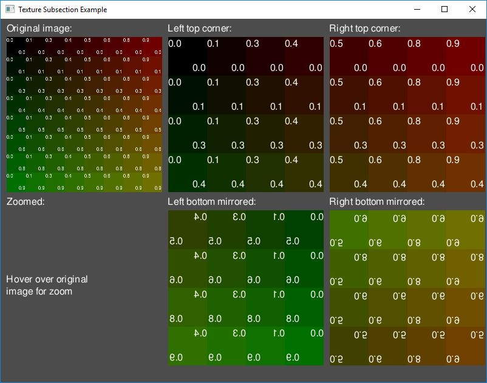

Example: Texture Subsection
=================

The purpose of this example is to show how to render images/textures on the screen, including subsection and mirroring.

**Requires finegraphics and finemath module to run**

<pre>
#include &lt;<a href="">ffw/graphics.h</a>&gt;
#include &lt;<a href="">ffw/math.h</a>&gt;
#include &lt;fstream&gt;

#define TEXTURE_SIZE (512*512*3)
static unsigned char pixels[TEXTURE_SIZE];

class App: public <a href="ffw_GLFWRenderWindow.html">ffw::GLFWRenderWindow</a> &#123;
public:
    App()&#123;
    &#125;

    ~App()&#123;
    &#125;

    bool <a href="ffw_GLFWRenderWindow.html#68554ce1">setup</a>() override &#123;
        std::cout &lt;&lt; "Window setup!" &lt;&lt; std::endl;

        if (!font.createFromFile(this, "FreeSans.ttf", 16, 72)) &#123;
            std::cerr &lt;&lt; "Failed to create font from: \'FreeSans.ttf\' File is missing?" &lt;&lt; std::endl;
            return false;
        &#125;

        std::ifstream input("grid-rgb8.raw", std::ios::in | std::ios::binary);
        if (!input) &#123;
            std::cerr &lt;&lt; "Failed to open 'grid-rgb8.raw' File is missing?" &lt;&lt; std::endl;
            return false;
        &#125;

        if(!texture.create(this, 512, 512, GL_RGB8, GL_RGB, GL_UNSIGNED_BYTE)) &#123;
            std::cerr &lt;&lt; "Failed to create texture!" &lt;&lt; std::endl;
            return false;
        &#125;

        // We expect 512 * 512 * 3 bytes, we should check for the file size first.
        // For the purpose of the example we are not going to do checks.
        input.read((char*)pixels, TEXTURE_SIZE);
        input.close();

        texture.setPixels(0, 0, 0, 512, 512, pixels);

        // Required for font blending
        glEnable(GL_BLEND);
        glBlendFunc(GL_SRC_ALPHA, GL_ONE_MINUS_SRC_ALPHA);

        // Background color
        glClearColor(0.3f, 0.3f, 0.3f, 1.0f);

        return true;
    &#125;

    void <a href="ffw_GLFWRenderWindow.html#93db1d16">render</a>() override &#123;
        glClear(GL_COLOR_BUFFER_BIT | GL_DEPTH_BUFFER_BIT);

        this-&gt;<a href="ffw_RenderContext.html#6b8df6af">setDrawColor</a>(<a href="ffw.html#e71e7885">ffw::rgb</a>(0xFFFFFF)); // White color

        // In OpenGL, textures are mirrored vertically
        this-&gt;<a href="ffw_RenderContext.html#a583cfdb">drawString</a>(10, 5, &amp;font, "Original image:");
        this-&gt;<a href="ffw_RenderContext.html#cc8d1ac9">drawTexture2D</a>(10, 30, 256, 256, &amp;texture);

        // Zoomed image
        this-&gt;<a href="ffw_RenderContext.html#a583cfdb">drawString</a>(10, 291, &amp;font, "Zoomed:");
        if(mousePos.x &gt;= 10 &amp;&amp; mousePos.x &lt;= 266 &amp;&amp; mousePos.y &gt;= 30 &amp;&amp; mousePos.y &lt;= 286) &#123;
            <a href="ffw_Vec2.html">ffw::Vec2i</a> offset;
            offset.<a href="ffw_Vec2.html#b2ccd122">x</a> = <a href="ffw.html#e670592a">ffw::remap</a>(mousePos.x, 10, 266, 0, 512);
            offset.<a href="ffw_Vec2.html#370d6d90">y</a> = <a href="ffw.html#e670592a">ffw::remap</a>(mousePos.y, 30, 286, 0, 512);
            this-&gt;<a href="ffw_RenderContext.html#e7341ced">drawTexture2DSub</a>(10, 316, 256, 256, &amp;texture, offset.<a href="ffw_Vec2.html#b2ccd122">x</a> - 16, offset.<a href="ffw_Vec2.html#370d6d90">y</a> - 16, 32, 32);
        &#125; 
        else &#123;
            this-&gt;<a href="ffw_RenderContext.html#a583cfdb">drawString</a>(10, 291 + 128, &amp;font, "Hover over original\nimage for zoom");
        &#125;

        // [256, 256] subsection at pos [0, 0]
        this-&gt;<a href="ffw_RenderContext.html#a583cfdb">drawString</a>(276, 5, &amp;font, "Left top corner:");
        this-&gt;<a href="ffw_RenderContext.html#d35d4e67">drawTexture2DSubMirror</a>(276, 30, 256, 256, &amp;texture, 0, 0, 256, 256, false, false);

        // [256, 256] subsection at pos [256, 0]
        this-&gt;<a href="ffw_RenderContext.html#a583cfdb">drawString</a>(542, 5, &amp;font, "Right top corner:");
        this-&gt;<a href="ffw_RenderContext.html#d35d4e67">drawTexture2DSubMirror</a>(542, 30, 256, 256, &amp;texture, 256, 0, 256, 256, false, false);

        // [256, 256] subsection at pos [0, 256] mirrored horizontally
        this-&gt;<a href="ffw_RenderContext.html#a583cfdb">drawString</a>(276, 291, &amp;font, "Left bottom mirrored:");
        this-&gt;<a href="ffw_RenderContext.html#d35d4e67">drawTexture2DSubMirror</a>(276, 316, 256, 256, &amp;texture, 0, 256, 256, 256, true, false);

        // [256, 256] subsection at pos [256, 256] mirrored vertically
        this-&gt;<a href="ffw_RenderContext.html#a583cfdb">drawString</a>(542, 291, &amp;font, "Right bottom mirrored:");
        this-&gt;<a href="ffw_RenderContext.html#d35d4e67">drawTexture2DSubMirror</a>(542, 316, 256, 256, &amp;texture, 256, 256, 256, 256, false, true);
    &#125;

    void <a href="ffw_GLFWRenderWindow.html#eb5dbf50">close</a>() override &#123;
        texture.destroy();
    &#125;

    void <a href="ffw_GLFWRenderWindow.html#707e5f61">textInputEvent</a>(unsigned int C) override &#123;
    &#125;

    void <a href="ffw_GLFWRenderWindow.html#ce25f297">keyPressedEvent</a>(<a href="ffw.html#23661d50">ffw::Key</a> key, <a href="ffw.html#e03b52d5">ffw::Mode</a> mode) override &#123;
    &#125;

    void <a href="ffw_GLFWRenderWindow.html#eaa1a6c6">mouseMovedEvent</a>(int mousex, int mousey) override &#123;
        mousePos.set(mousex, mousey);
    &#125;

    void <a href="ffw_GLFWRenderWindow.html#fbe7329a">mouseScrollEvent</a>(int scroll) override &#123;
    &#125;

    void <a href="ffw_GLFWRenderWindow.html#1e8d2373">mouseButtonEvent</a>(<a href="ffw.html#f80e46cc">ffw::MouseButton</a> button, <a href="ffw.html#e03b52d5">ffw::Mode</a> mode) override &#123;
    &#125;

    void <a href="ffw_GLFWRenderWindow.html#e4b39662">windowResizedEvent</a>(int width, int height) override &#123;
    &#125;

    void <a href="ffw_GLFWRenderWindow.html#e57c71a5">windowMovedEvent</a>(int windowx, int windowy) override &#123;
    &#125;

    void <a href="ffw_GLFWRenderWindow.html#727ce05e">windowFocusEvent</a>(bool focus) override &#123;
    &#125;

    void <a href="ffw_GLFWRenderWindow.html#d1e6b4ff">windowCloseEvent</a>() override &#123;
        this-&gt;<a href="ffw_GLFWRenderWindow.html#f26e03bc">shouldClose</a>(true);
    &#125;

    void <a href="ffw_GLFWRenderWindow.html#c02a201a">filesDroppedEvent</a>(std::vector&lt;std::string&gt; filelist) override &#123;
    &#125;
private:
    <a href="ffw_TrueTypeFont.html">ffw::TrueTypeFont</a> font;
    <a href="ffw_Texture2D.html">ffw::Texture2D</a> texture;
    <a href="ffw_Vec2.html">ffw::Vec2i</a> mousePos;
&#125;;

int main(int argc, char *argv[])&#123;
    // Instance to our app class
    App app;

    // set arguments
    <a href="ffw_GLFWRenderWindowArgs.html">ffw::GLFWRenderWindowArgs</a> args;
    args.<a href="ffw_GLFWRenderWindowArgs.html#427706b8">size</a>.<a href="ffw_Vec2.html#e49a9b9e">set</a>(800, 600);
    args.<a href="ffw_GLFWRenderWindowArgs.html#b1b7d616">title</a> = "Texture Subsection Example";

    // create window
    if(!app.create(args, NULL))&#123;
        std::cerr &lt;&lt; "Failed to create window!" &lt;&lt; std::endl;
        return 1;
    &#125;

    // Run setup
    if(!app.setup())&#123;
        std::cerr &lt;&lt; "Failed to setup window!" &lt;&lt; std::endl;
        return 1;
    &#125;

    // The main window loop
    while(app.shouldRender())&#123;
        app.renderFrame();
        app.poolEvents();
    &#125;

    // destroy window, this will delete all graphics data used by the window.
    // Must be called after the setup and before the graphics
    // is terminated
    app.destroy();
    return 0;
&#125;

</pre>

 

