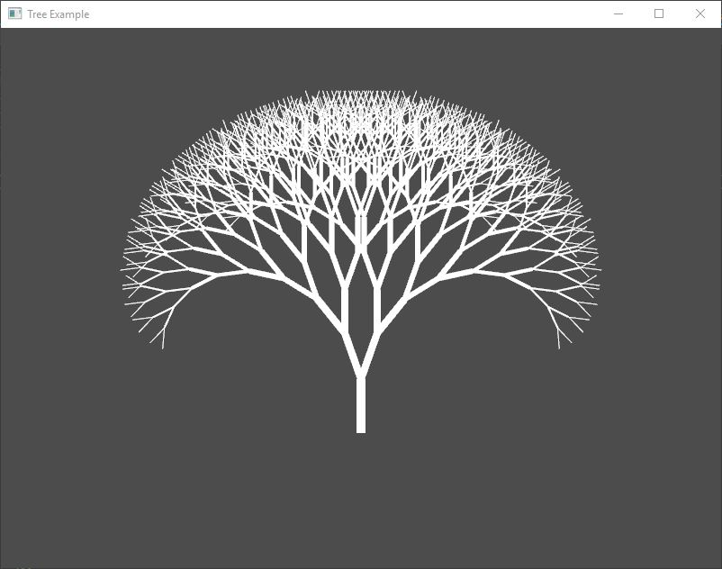

Example: Tree
=================

The purpose of this example is to show how simple is to draw 2D primitives and how to use vectors.

**Requires finegraphics and finemath module to run**

<pre>
#include &lt;<a href="">ffw/graphics.h</a>&gt;
#include &lt;<a href="">ffw/math.h</a>&gt;

class App : public <a href="ffw_GLFWRenderWindow.html">ffw::GLFWRenderWindow</a> &#123;
public:
    App() &#123;
        rotStep = 0;
    &#125;

    ~App() &#123;
    &#125;

    bool <a href="ffw_GLFWRenderWindow.html#68554ce1">setup</a>() override &#123;
        glEnable(GL_BLEND);
        glBlendFunc(GL_SRC_ALPHA, GL_ONE_MINUS_SRC_ALPHA);
        glClearColor(0.3f, 0.3f, 0.3f, 1.0f);

        return true;
    &#125;

    void drawBranch(const <a href="ffw_Vec2.html">ffw::Vec2f</a>&amp; pos, float dir, float add, int steps, float length) &#123;
        if (steps &lt;= 0)return;
        
        this-&gt;<a href="ffw_RenderContext.html#7acd1170">setOutlineSize</a>(steps);
        <a href="ffw_Vec2.html">ffw::Vec2f</a> end = pos + <a href="ffw.html#fcfaa6c5">ffw::Vec2f</a>(length, 0).<a href="ffw_Vec2.html#dd178631">rotate</a>(dir);
        this-&gt;<a href="ffw_RenderContext.html#5bb70248">drawLine</a>(pos.<a href="ffw_Vec2.html#b2ccd122">x</a>, pos.<a href="ffw_Vec2.html#370d6d90">y</a>, end.<a href="ffw_Vec2.html#b2ccd122">x</a>, end.<a href="ffw_Vec2.html#370d6d90">y</a>);

        drawBranch(end, dir - add, add, steps - 1, length * 0.9f);
        drawBranch(end, dir + add, add, steps - 1, length * 0.9f);
    &#125;

    void <a href="ffw_GLFWRenderWindow.html#93db1d16">render</a>() override &#123;
        glClear(GL_COLOR_BUFFER_BIT | GL_DEPTH_BUFFER_BIT);

        // In the moddile horizontally
        // 1 fourth from the bottom vertically
        auto pos = <a href="ffw.html#fcfaa6c5">ffw::Vec2f</a>(float(this-&gt;<a href="ffw_GLFWRenderWindow.html#70919473">getSize</a>().x / 2), float(this-&gt;<a href="ffw_GLFWRenderWindow.html#70919473">getSize</a>().y - this-&gt;<a href="ffw_GLFWRenderWindow.html#70919473">getSize</a>().y / 4));
        int length = std::min(this-&gt;<a href="ffw_GLFWRenderWindow.html#70919473">getSize</a>().x, this-&gt;<a href="ffw_GLFWRenderWindow.html#70919473">getSize</a>().y) / 10;

        this-&gt;<a href="ffw_RenderContext.html#6b8df6af">setDrawColor</a>(<a href="ffw.html#e71e7885">ffw::rgb</a>(255, 255, 255));
        drawBranch(pos, 270.0f, rotStep, 10, length);
    &#125;

    void <a href="ffw_GLFWRenderWindow.html#eb5dbf50">close</a>() override &#123;
    &#125;

    void <a href="ffw_GLFWRenderWindow.html#707e5f61">textInputEvent</a>(unsigned int C) override &#123;

    &#125;

    void <a href="ffw_GLFWRenderWindow.html#ce25f297">keyPressedEvent</a>(<a href="ffw.html#23661d50">ffw::Key</a> key, <a href="ffw.html#e03b52d5">ffw::Mode</a> mode) override &#123;
    &#125;

    void <a href="ffw_GLFWRenderWindow.html#eaa1a6c6">mouseMovedEvent</a>(int mousex, int mousey) override &#123;
        rotStep = <a href="ffw.html#e670592a">ffw::remap</a>((double)mousex, 0.0, (double)this-&gt;<a href="ffw_GLFWRenderWindow.html#70919473">getSize</a>().x, 0.0, 90.0);
    &#125;

    void <a href="ffw_GLFWRenderWindow.html#fbe7329a">mouseScrollEvent</a>(int scroll) override &#123;
    &#125;

    void <a href="ffw_GLFWRenderWindow.html#1e8d2373">mouseButtonEvent</a>(<a href="ffw.html#f80e46cc">ffw::MouseButton</a> button, <a href="ffw.html#e03b52d5">ffw::Mode</a> mode) override &#123;
    &#125;

    void <a href="ffw_GLFWRenderWindow.html#e4b39662">windowResizedEvent</a>(int width, int height) override &#123;
    &#125;

    void <a href="ffw_GLFWRenderWindow.html#e57c71a5">windowMovedEvent</a>(int windowx, int windowy) override &#123;
    &#125;

    void <a href="ffw_GLFWRenderWindow.html#727ce05e">windowFocusEvent</a>(bool focus) override &#123;
    &#125;

    void <a href="ffw_GLFWRenderWindow.html#d1e6b4ff">windowCloseEvent</a>() override &#123;
        this-&gt;<a href="ffw_GLFWRenderWindow.html#f26e03bc">shouldClose</a>(true);
    &#125;

    void <a href="ffw_GLFWRenderWindow.html#c02a201a">filesDroppedEvent</a>(std::vector&lt;std::string&gt; filelist) override &#123;
    &#125;
private:
    float rotStep;
&#125;;

int main(int argc, char *argv[]) &#123;
    // Instance to our app class
    App app;

    // set arguments
    <a href="ffw_GLFWRenderWindowArgs.html">ffw::GLFWRenderWindowArgs</a> args;
    args.<a href="ffw_GLFWRenderWindowArgs.html#427706b8">size</a>.<a href="ffw_Vec2.html#e49a9b9e">set</a>(800, 600);
    args.<a href="ffw_GLFWRenderWindowArgs.html#b1b7d616">title</a> = "Tree Example";
    args.<a href="ffw_GLFWRenderWindowArgs.html#17443f00">samples</a> = 4;

    // create window
    if (!app.create(args, NULL)) &#123;
        std::cerr &lt;&lt; "Failed to create window!" &lt;&lt; std::endl;
        return 1;
    &#125;

    // Run setup
    if (!app.setup()) &#123;
        std::cerr &lt;&lt; "Failed to setup window!" &lt;&lt; std::endl;
        return 1;
    &#125;

    // The main window loop
    while (app.shouldRender()) &#123;
        app.renderFrame();
        app.waitForEvents();
    &#125;

    // destroy window, this will delete all graphics data used by the window.
    // Must be called after the setup and before the graphics
    // is terminated
    app.destroy();
    return 0;
&#125;

</pre>

 

