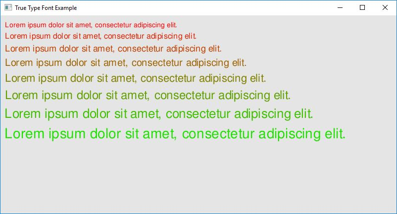

Example: True Type Font
=================

The purpose of this example is to show capability of loading and rendering a True Type based font. The code below should be simple enough to understand. Similary to [Bitmap Font](md_doc_markdown_example-bitmap-font.html), this example uses True Type fonts instead of an image.

**Requires finegraphics and finemath module to run**

<pre>
#include &lt;<a href="">ffw/graphics.h</a>&gt;
#define NUM_OF_FONTS (8)

class App: public <a href="ffw_GLFWRenderWindow.html">ffw::GLFWRenderWindow</a> &#123;
public:
    App()&#123;
    &#125;

    ~App()&#123;
    &#125;

    bool <a href="ffw_GLFWRenderWindow.html#68554ce1">setup</a>() override &#123;
        std::cout &lt;&lt; "Window setup!" &lt;&lt; std::endl;

        for(int i = 0; i &lt; NUM_OF_FONTS; i++)&#123;
            if(!fonts[i].createFromFile(this, "FreeSans.ttf", 14 + i*2, 72))&#123;
                std::cerr &lt;&lt; "Failed to create font from: \'FreeSans.ttf\' File is missing?" &lt;&lt; std::endl;
                return false;
            &#125;
        &#125;

        // Required for font blending
        glEnable(GL_BLEND);
        glBlendFunc(GL_SRC_ALPHA, GL_ONE_MINUS_SRC_ALPHA);

        // Background color
        glClearColor(0.9f, 0.9f, 0.9f, 1.0f);

        return true;
    &#125;

    void <a href="ffw_GLFWRenderWindow.html#93db1d16">render</a>() override &#123;
        glClear(GL_COLOR_BUFFER_BIT | GL_DEPTH_BUFFER_BIT);

        this-&gt;<a href="ffw_RenderContext.html#6b8df6af">setDrawColor</a>(<a href="ffw.html#e71e7885">ffw::rgb</a>(0xFF0000)); // Red color

        int height = 0;
        for(int i = 0; i &lt; NUM_OF_FONTS; i++)&#123;
            this-&gt;<a href="ffw_RenderContext.html#6b8df6af">setDrawColor</a>(<a href="ffw.html#e71e7885">ffw::rgb</a>(255 - i*(256 / NUM_OF_FONTS), i*(256 / NUM_OF_FONTS), 0));
            this-&gt;<a href="ffw_RenderContext.html#a583cfdb">drawString</a>(10, 10 + height, &amp;fonts[i], "Lorem ipsum dolor sit amet, consectetur adipiscing elit.");
            // Line height is a simple formula of (height * weight)
            // wehre height is the height of the font
            // and weight is line spacing (1.0 and more)
            height += int(fonts[i].getSizePixels() * 1.5f);
        &#125;
    &#125;

    void <a href="ffw_GLFWRenderWindow.html#eb5dbf50">close</a>() override &#123;
        std::cout &lt;&lt; "Window is closing!" &lt;&lt; std::endl;
        for(int i = 0; i &lt; NUM_OF_FONTS; i++) &#123;
            fonts[i].destroy();
        &#125;
    &#125;

    void <a href="ffw_GLFWRenderWindow.html#d1e6b4ff">windowCloseEvent</a>() override &#123;
        std::cout &lt;&lt; "Window close button pressed!" &lt;&lt; std::endl;
        this-&gt;<a href="ffw_GLFWRenderWindow.html#f26e03bc">shouldClose</a>(true);
    &#125;

private:
    <a href="ffw_TrueTypeFont.html">ffw::TrueTypeFont</a> fonts[NUM_OF_FONTS];
&#125;;

int main(int argc, char *argv[])&#123;
    // Instance to our app class
    App app;

    // set arguments
    <a href="ffw_GLFWRenderWindowArgs.html">ffw::GLFWRenderWindowArgs</a> args;
    args.<a href="ffw_GLFWRenderWindowArgs.html#427706b8">size</a>.<a href="ffw_Vec2.html#e49a9b9e">set</a>(800, 400);
    args.<a href="ffw_GLFWRenderWindowArgs.html#b1b7d616">title</a> = "True Type Font Example";

    // create window
    if(!app.create(args, NULL))&#123;
        std::cerr &lt;&lt; "Failed to create window!" &lt;&lt; std::endl;
        return 1;
    &#125;

    // Run setup
    if(!app.setup())&#123;
        std::cerr &lt;&lt; "Failed to setup window!" &lt;&lt; std::endl;
        system("pause");
        return 1;
    &#125;

    // The main window loop
    while(app.shouldRender())&#123;
        app.renderFrame();
        app.poolEvents();
    &#125;

    // destroy window, this will delete all graphics data used by the window.
    // Must be called after the setup and before the graphics
    // is terminated
    app.destroy();
&#125;

</pre>

 

