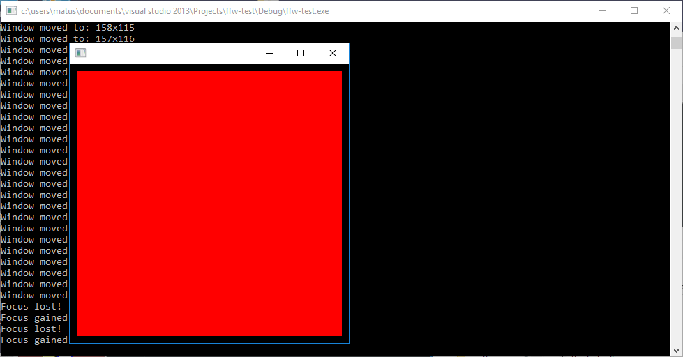

Creating a Rendering Window
=================

This tutorial will explain how to create and manage an OpenGL rendering window using [ffw::GLFWRenderWindow](ffw_GLFWRenderWindow.html) class.

#### Starting from scratch

First, you need to include the necessary FFW header file. The FineFramework is separated into several modules: Graphics, Math, Data, Gui, etc... They are all independent, however, they all rely on the Math module. The header file you are looking for is [ffw/graphics.h]()

<pre>
#include &lt;ffw/graphics.h&gt;

</pre>

> You don't need to include math module as well, it is automatically included by **all** modules. 

Next, we need to create our own class which will hold the functionality of the window. Simply, create a class derived from [ffw::GLFWRenderWindow](ffw_GLFWRenderWindow.html).

<pre>
#include &lt;ffw/graphics.h&gt;

class MyCustomClass: public ffw::GLFWRenderWindow &#123;
public:
    MyCustomClass()&#123;
    &#125;

    ~MyCustomClass()&#123;
    &#125;
&#125;

</pre>

Next, you will need to override some basic method from [ffw::GLFWRenderWindow](ffw_GLFWRenderWindow.html):
* **[ffw::GLFWRenderWindow::setup](ffw_GLFWRenderWindow.html#68554ce1)** - This method is called only once before the rendering begins. Put your code here that needs to be executed once.

* **[ffw::GLFWRenderWindow::render](ffw_GLFWRenderWindow.html#93db1d16)** - This method is called each frame. If you want to render something, this is a place to put it in.

* **[ffw::GLFWRenderWindow::close](ffw_GLFWRenderWindow.html#eb5dbf50)** - This method is called only once when the window is begin destroyed. If you need to do a clean-up, this is a place for you.

* **[ffw::GLFWRenderWindow::windowCloseEvent](ffw_GLFWRenderWindow.html#d1e6b4ff)** - This mthod is called when you click on the [X] button on the window.

<pre>
#include &lt;ffw/graphics.h&gt;

class MyCustomClass: public ffw::GLFWRenderWindow &#123;
public:
    MyCustomClass()&#123;
    &#125;

    ~MyCustomClass()&#123;
    &#125;

    bool setup() override &#123;
        // Return true or false
        // true - Setup is OK
        // false - Setup failed
        return true;
    &#125;

    void render() override &#123;
        this-&gt;setDrawColor(ffw::rgb(0xFF0000)); // Red color
        this-&gt;drawRectangle(10, 10, getSize().x-20, getSize().y-20);
    &#125;

    void close() override &#123;
        // Window is being destroyed
    &#125;

    void windowCloseEvent() override &#123;
        std::cout &lt;&lt; "Window close button pressed!" &lt;&lt; std::endl;
        // Let the window know that we want to be closed.
        this-&gt;shouldClose(true);
    &#125;
&#125;

</pre>

All C++ applications need a main function

<pre>
#include &lt;ffw/graphics.h&gt;

class MyCustomClass: public ffw::GLFWRenderWindow &#123;
public:
    ...
&#125;

int main(int argc, char *argv[])&#123;
    return 0;
&#125;

</pre>

Inside of main, we will create an instance of our window. First, we need to set arguments for the window. These arguments define what the size of the window should be (or the position) when the window is created and so on. All the arguments and its description can be found here [ffw::GLFWRenderWindowArgs](ffw_GLFWRenderWindowArgs.html).

<pre>
#include &lt;ffw/graphics.h&gt;

class MyCustomClass: public ffw::GLFWRenderWindow &#123;
public:
    ...
&#125;

int main(int argc, char *argv[])&#123;
    // Set arguments
    ffw::GLFWRenderWindowArgs args;
    // Set initial size to 400x400 pixels
    args.size.set(400, 400);
    // Set the window title to "Empty Example" (UTF-8 compatible)
    args.title = "Empty Example";

    return 0;
&#125;

</pre>

Lastly, we need to declare an instance of our window and write a code that will run the main loop. This will be explained below.

<pre>
#include &lt;ffw/graphics.h&gt;

class MyCustomClass: public ffw::GLFWRenderWindow &#123;
public:
    ...
&#125;

int main(int argc, char *argv[])&#123;
    // Instance to our window class
    MyCustomWindow myCustomWindow;
    // Set arguments
    ffw::GLFWRenderWindowArgs args;
    args.size.Set(400, 400);
    args.title = "Empty Example";
    // Create window
    if(!myCustomWindow.create(args, NULL))&#123;
        std::cerr &lt;&lt; "Failed to create window!" &lt;&lt; std::endl;
        return 1;
    &#125;
    // Run setup
    if(!myCustomWindow.setup())&#123;
        std::cerr &lt;&lt; "Failed to setup window!" &lt;&lt; std::endl;
        return 1;
    &#125;
    // The main window loop
    while(myCustomWindow.shouldRender())&#123;
        myCustomWindow.renderFrame();
        myCustomWindow.poolEvents();
    &#125;
    // Destroy window, this will delete all graphics data used by the window.
    // Must be called after the setup and before the graphics
    // is terminated
    myCustomWindow.destroy();
    return 0;
&#125;

</pre>

The `if(!myCustomWindow.create(args, NULL)){` will create a new rendering window. If this fails, your parameters are wrong (width or height is zero, etc...). This may also fail if your OS does not support OpenGL. In this case, it will print out "Failed to iniailize GLFW graphics!". If you are using remote connection over X11 on Linux, make sure your DISPLAY system variable is set.

The `if(!myCustomWindow.create(args, NULL)){` will set up necessary OpenGL environment for the window and then it will call your own overriden function `MyCustomClass::Setup()`

The `while(myCustomWindow.shouldRender()){` will ask the window if we should continue rendering the window. The method is defined inside of ffw::GLFWRenderWindow::ShouldRender and will return false if one passed a 'true' into ffw::GLFWRenderWindow::ShouldClose method.

Inside of the loop, you need to call `myCustomWindow.renderFrame();` which will set the OpenGL viewport and then it will call myCustomWindow::Render() function. The `myCustomWindow.poolEvents();` will check for the user input.

Now, compile it and you should see something like this image below. If you are not sure how to compile FFW application or if you get any errors, please refer to the [Getting started section in tutorials](md_markdown_tutorials.html).

#### Additional window event methods

You might ask yourself, how do I get a mouse position? You will need to override a specific function inside of [ffw::GLFWRenderWindow](ffw_GLFWRenderWindow.html) and they are the following:

* **[ffw::GLFWRenderWindow::textInputEvent](ffw_GLFWRenderWindow.html#707e5f61)**

* **[ffw::GLFWRenderWindow::keyPressedEvent](ffw_GLFWRenderWindow.html#ce25f297)**

* **[ffw::GLFWRenderWindow::mouseMovedEvent](ffw_GLFWRenderWindow.html#eaa1a6c6)**

* **[ffw::GLFWRenderWindow::mouseScrollEvent](ffw_GLFWRenderWindow.html#fbe7329a)**

* **[ffw::GLFWRenderWindow::mouseButtonEvent](ffw_GLFWRenderWindow.html#1e8d2373)**

* **[ffw::GLFWRenderWindow::windowResizedEvent](ffw_GLFWRenderWindow.html#e4b39662)**

* **[ffw::GLFWRenderWindow::windowMovedEvent](ffw_GLFWRenderWindow.html#e57c71a5)**

* **[ffw::GLFWRenderWindow::windowCloseEvent](ffw_GLFWRenderWindow.html#d1e6b4ff)**

* **[ffw::GLFWRenderWindow::windowFocusEvent](ffw_GLFWRenderWindow.html#727ce05e)**

* **[ffw::GLFWRenderWindow::filesDroppedEvent](ffw_GLFWRenderWindow.html#c02a201a)**

They are self explanatory. To read more about each method, simply follow the link or look it up in the documentation of [ffw::GLFWRenderWindow](ffw_GLFWRenderWindow.html).

To use the function, for example MouseMovedEvent (tracking the mouse position) simply add it into your class and mark is as `override`

<pre>
#include &lt;ffw/graphics.h&gt;

class MyCustomClass: public ffw::GLFWRenderWindow &#123;
public:
    ...
    void mouseMovedEvent(int mousex, int mousey) override &#123;
        std::cout &lt;&lt; "Mouse moved to: " &lt;&lt; mousex &lt;&lt; "x" &lt;&lt; mousey &lt;&lt; std::endl;
    &#125;
    ...
&#125;

</pre>

 

