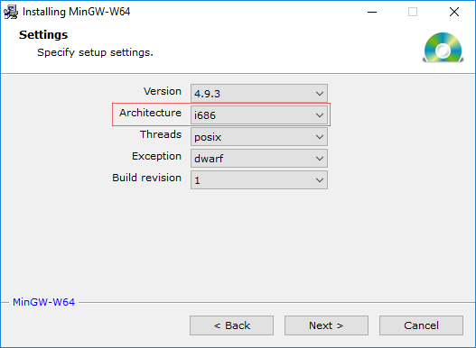
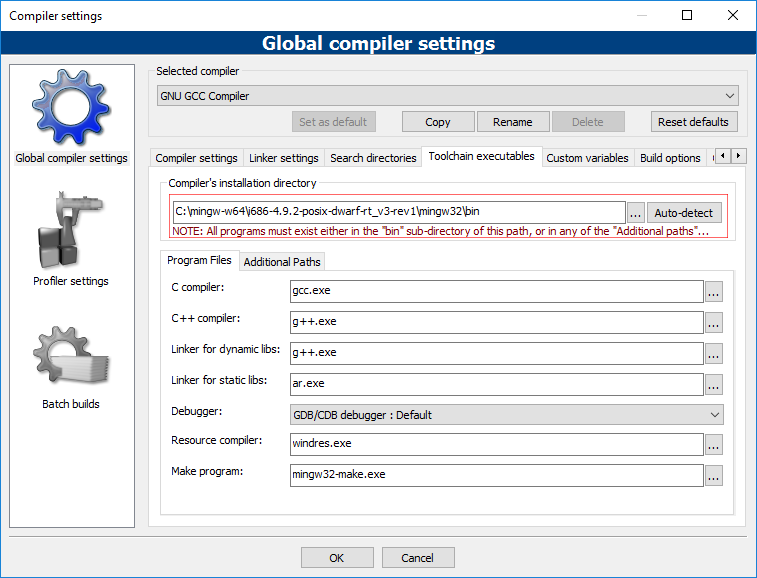
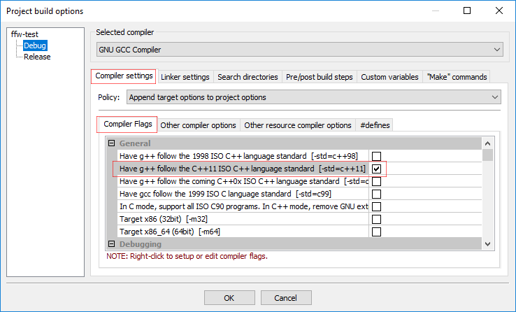
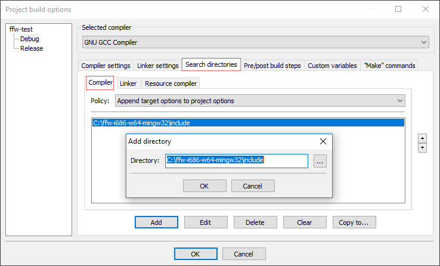
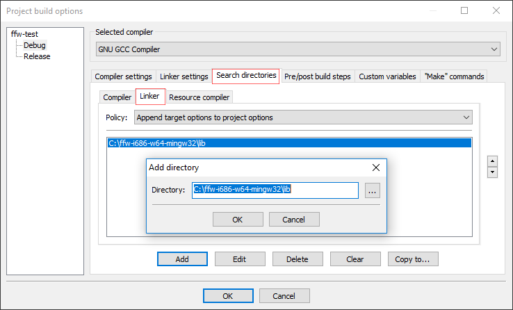
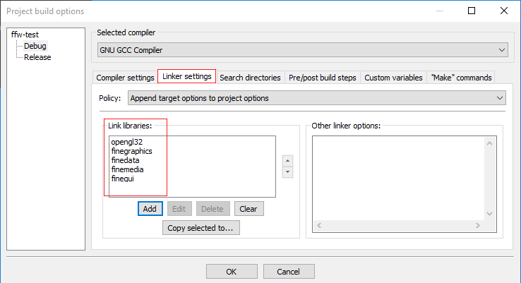
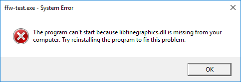
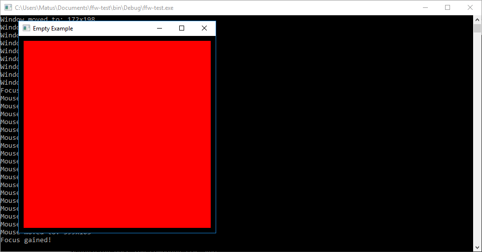

CodeBlocks and MinGW
=================

This tutorial will explain how to include any FFW module into your C++ project. You will need Code::Blocks which comes in two versions, with MinGW compiler and without it. It is highly recommended to use MinGW-w64 which supports much more features than original MinGW. MinGW-w64 can be downloaded from [https://sourceforge.net/projects/mingw-w64/](https://sourceforge.net/projects/mingw-w64/) and download CodeBlocks **without MinGW** from [http://www.codeblocks.org/downloads/26](http://www.codeblocks.org/downloads/26)

If you wish yo use MinGW over MinGW-w64, you can download the setup from [https://sourceforge.net/projects/mingw/](https://sourceforge.net/projects/mingw/)

#### Installing MinGW-w64

When installing MinGW-w64, **use either i686 architecture or x86_64**. (i686 = 32-bit and x86_64 = 64-bit) The version of the compiler must be **4.9.3 or newer!**

Next, when you install CodeBlocks, run it and go to **Settings (main top menu bar) -> Compiler -> Toolchain Executables** and set the compiler installation directory to the compiler's bin path. For example: `C:\Program Files (x86)\mingw-w64\i686-5.4.0-posix-dwarf-rt_v5-rev0\mingw32\bin`

#### Installing MinGW (not w64)

To install MinGW, follow [http://www.mingw.org/wiki/HOWTO_Install_the_MinGW_GCC_Compiler_Suite](http://www.mingw.org/wiki/HOWTO_Install_the_MinGW_GCC_Compiler_Suite) The next few steps are all exactly same for both MinGW and MinGW-w64, you will just need to set different paths.

#### Installing FFW

First, you will need to download glext.h (this is only necessary if using Graphics Module). Glext is an OpenGL extension header file which is updated regularly several times per year and can be downloaded from: [https://www.opengl.org/registry/api/GL/glext.h](https://www.opengl.org/registry/api/GL/glext.h) The easiest way for MinGW to know about the glext header is to put it into `C:\path\to\mingw\install\folder\mingw32\XXX-w64-mingw32\include\GL` The folder might already contain an old glext.h file!

Next, download the pre-built FineFramework DLLs from [GitHub Release Page](https://github.com/matusnovak/fineframework/releases). Look for the most recent release and download the **ffw-XXX-w64-mingw32.zip** zip file! **Make sure you download correct one! Either i686 or x84_64 depending on your compiler!** You do not need to download the source code! You can unpack the zip wherever you like, it does not matter.

The zip contains the following folders:

* **bin** - You can find DLLs files here, they are needed when running your C++ project executable. When distributing your executable, you must also include these DLLs next to your exe file!

* **include** - Header files needed by the compiler.

* **lib** - A-files also needed by the compiler, more precisely, needed by the linker.

#### Configuring FFW project

Create a CodeBlocks console application project. You will need to let the compiler know where to find FFW headers and library files. The DLLs are not needed for the compiler itself, instead the DLLs must be copied into the folder where your executable is, we will get into that later.

In the Project Workspace, right click on your project name and select **Build Options**. Next, add the following properties listed below to **both Release and Debug** configuration. Go to **Compiler Settings -> Compiler Flags** and enable **Have g++ follow the C++11 ISO** alternatively, go to #defines and add -std=c++11 flag.

Now, go to **Search Directories -> Compiler** and add a new path to include folder of your downloaded copy of pre-build FFW, for example: `C:\ffw-XXX-w64-mingw32\include`

For the library files, go to **Search Directories -> Linker** and add a new path to `C:\ffw-XXX-w64-mingw32\lib`

Now, go to the **Linker Settings** and add the following libraries to the **Link libraries** window on the left side: `opengl32`, `finegraphics`, `finedata`, `finemedia`, and `finegui`. (You don't need to include all modules if you are not going to use them in your project).

_Note that OpenGL library is needed only when using Graphics Module!_

#### Your first code

Your configuration is done, now test the project to make sure everything works. Copy paste the following example:

<pre>
#include &lt;<a href="">ffw/graphics.h</a>&gt;

class App: public <a href="ffw_GLFWRenderWindow.html">ffw::GLFWRenderWindow</a> &#123;
public:
    App()&#123;
    &#125;

    ~App()&#123;
    &#125;

    bool <a href="ffw_GLFWRenderWindow.html#68554ce1">setup</a>() override &#123;
        std::cout &lt;&lt; "Window setup!" &lt;&lt; std::endl;

        <a href="ffw_Texture2D.html">ffw::Texture2D</a> first;
        <a href="ffw_Texture2D.html">ffw::Texture2D</a> second;

        <a href="">std::swap</a>(first, second);

        return true;
    &#125;

    void <a href="ffw_GLFWRenderWindow.html#93db1d16">render</a>() override &#123;
        this-&gt;<a href="ffw_RenderContext.html#6b8df6af">setDrawColor</a>(<a href="ffw.html#e71e7885">ffw::rgb</a>(0xFF0000)); // Red color
        this-&gt;<a href="ffw_RenderContext.html#e04aedbb">drawRectangle</a>(10, 10, <a href="ffw_GLFWRenderWindow.html#70919473">getSize</a>().x-20, <a href="ffw_GLFWRenderWindow.html#70919473">getSize</a>().y-20);
    &#125;

    void <a href="ffw_GLFWRenderWindow.html#eb5dbf50">close</a>() override &#123;
        std::cout &lt;&lt; "Window is closing!" &lt;&lt; std::endl;
    &#125;

    void <a href="ffw_GLFWRenderWindow.html#707e5f61">textInputEvent</a>(unsigned int C) override &#123;

    &#125;

    void <a href="ffw_GLFWRenderWindow.html#ce25f297">keyPressedEvent</a>(<a href="ffw.html#23661d50">ffw::Key</a> key, <a href="ffw.html#e03b52d5">ffw::Mode</a> mode) override &#123;
        if(mode == <a href="ffw_Mode.html#0d56c1de">ffw::Mode::PRESSED</a>)
            std::cout &lt;&lt; "Key pressed: " &lt;&lt; key &lt;&lt; std::endl;
    &#125;

    void <a href="ffw_GLFWRenderWindow.html#eaa1a6c6">mouseMovedEvent</a>(int mousex, int mousey) override &#123;
        std::cout &lt;&lt; "Mouse moved to: " &lt;&lt; mousex &lt;&lt; "x" &lt;&lt; mousey &lt;&lt; std::endl;
    &#125;

    void <a href="ffw_GLFWRenderWindow.html#fbe7329a">mouseScrollEvent</a>(int scroll) override &#123;
        std::cout &lt;&lt; "Mouse scroll: " &lt;&lt; scroll &lt;&lt; std::endl;
    &#125;

    void <a href="ffw_GLFWRenderWindow.html#1e8d2373">mouseButtonEvent</a>(<a href="ffw.html#f80e46cc">ffw::MouseButton</a> button, <a href="ffw.html#e03b52d5">ffw::Mode</a> mode) override &#123;
        if(mode == <a href="ffw_Mode.html#0d56c1de">ffw::Mode::PRESSED</a>)&#123;
            switch(button)&#123;
                case <a href="ffw_MouseButton.html#8cc6295d">ffw::MouseButton::LEFT</a>: std::cout &lt;&lt; "Left mouse button pressed!" &lt;&lt; std::endl; break;
                case <a href="ffw_MouseButton.html#5cbd7d75">ffw::MouseButton::MIDDLE</a>: std::cout &lt;&lt; "middle mouse button pressed!" &lt;&lt; std::endl; break;
                case <a href="ffw_MouseButton.html#7f682f94">ffw::MouseButton::RIGHT</a>: std::cout &lt;&lt; "Right mouse button pressed!" &lt;&lt; std::endl; break;
                default: break;
            &#125;
        &#125;
    &#125;

    void <a href="ffw_GLFWRenderWindow.html#e4b39662">windowResizedEvent</a>(int width, int height) override &#123;
        std::cout &lt;&lt; "Window resized to: " &lt;&lt; width &lt;&lt; "x" &lt;&lt; height &lt;&lt; std::endl;
    &#125;

    void <a href="ffw_GLFWRenderWindow.html#e57c71a5">windowMovedEvent</a>(int windowx, int windowy) override &#123;
        std::cout &lt;&lt; "Window moved to: " &lt;&lt; windowx &lt;&lt; "x" &lt;&lt; windowy &lt;&lt; std::endl;
    &#125;

    void <a href="ffw_GLFWRenderWindow.html#727ce05e">windowFocusEvent</a>(bool focus) override &#123;
        if(focus)std::cout &lt;&lt; "Focus gained!" &lt;&lt; std::endl;
        else std::cout &lt;&lt; "Focus lost!" &lt;&lt; std::endl;
    &#125;

    void <a href="ffw_GLFWRenderWindow.html#d1e6b4ff">windowCloseEvent</a>() override &#123;
        std::cout &lt;&lt; "Window close button pressed!" &lt;&lt; std::endl;
        this-&gt;<a href="ffw_GLFWRenderWindow.html#f26e03bc">shouldClose</a>(true);
    &#125;

    void <a href="ffw_GLFWRenderWindow.html#c02a201a">filesDroppedEvent</a>(std::vector&lt;std::string&gt; filelist) override &#123;
        std::cout &lt;&lt; "Files dropped: " &lt;&lt; std::endl;
        for(const auto&amp; file : filelist)&#123;
            std::cout &lt;&lt; "\t\'" &lt;&lt; file &lt;&lt; "\'" &lt;&lt; std::endl;
        &#125;
    &#125;

&#125;;

int main(int argc, char *argv[])&#123;
    // Instance to our app class
    App app;

    // set arguments
    <a href="ffw_GLFWRenderWindowArgs.html">ffw::GLFWRenderWindowArgs</a> args;
    args.<a href="ffw_GLFWRenderWindowArgs.html#427706b8">size</a>.<a href="ffw_Vec2.html#e49a9b9e">set</a>(400, 400);
    args.<a href="ffw_GLFWRenderWindowArgs.html#b1b7d616">title</a> = "Empty Example";

    // create window
    if(!app.create(args, NULL))&#123;
        std::cerr &lt;&lt; "Failed to create window!" &lt;&lt; std::endl;
        return 1;
    &#125;

    // Run setup
    if(!app.setup())&#123;
        std::cerr &lt;&lt; "Failed to setup window!" &lt;&lt; std::endl;
        return 1;
    &#125;

    // The main window loop
    while(app.shouldRender())&#123;
        app.renderFrame();
        app.poolEvents();
    &#125;

    // destroy window, this will delete all graphics data used by the window.
    // Must be called after the setup and before the graphics
    // is terminated
    app.destroy();
    return 0;
&#125;

</pre>

Now compile it and run it! You might see the following message:

This is where DLL files comes...

Simply copy all DLLs files from `C:\path\to\ffw-XXX-w64-mingw32\bin` into `C:\path\to\your\codeblocks\project\bin\Debug` as well into Release folder. (this folder contains your executable file!)

Alternatively (not recommended!) you can put all DLLs into your MinGW bin folder. The folder is the same folder listed in the compiler's bin path located in: Settings (main top menu bar) -> Compiler -> Toolchain Executables.

When done, try to run the example again. This should show up:

 

