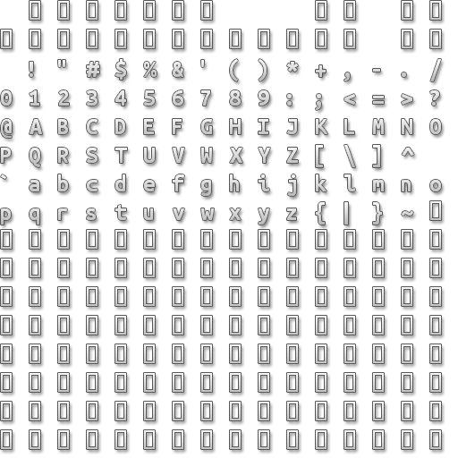

# Example: Bitmap Font

The purpose of this example is to show capability of loading and rendering a bitmap based font. It's up to the user how they decide to load and fill character data. The code below should be simple enough to understand. Similary to [True Type Font](true-type-font.html), this example uses an image instead of an True Type fonts.

**Requires finegraphics and finemath module to run**

The following texture is used (in RAW format) as a bitmap font:

[import, lang:"c_cpp"](../../examples/graphics/bitmapfont.cpp)