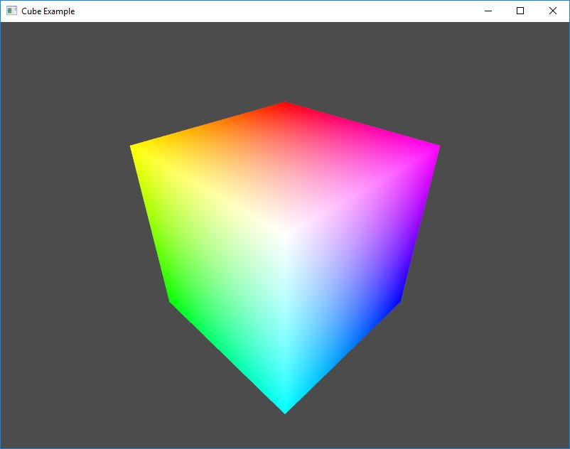

# Example: Cube

The purpose of this example is to show capability of rendering a very simple 3D object on the screen using OpenGL. The code shows how to easily create model view and projection matrices and some of the other vector operations. 

**Requires finegraphics and finemath module to run**

[import, lang:"c_cpp"](../../examples/graphics/cube.cpp)