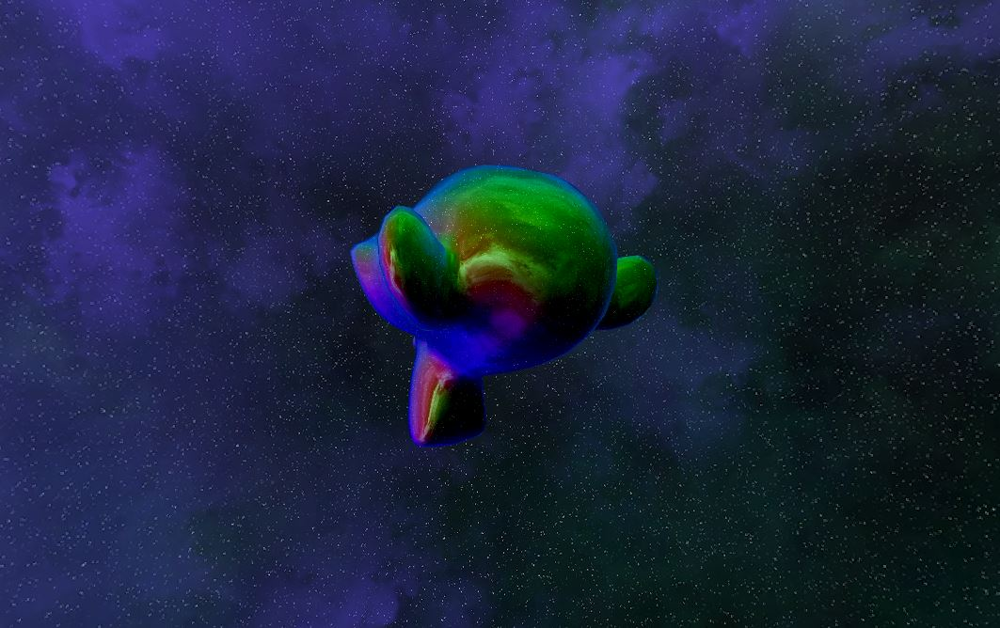

# Example: Cubemap

The purpose of this example is to show capability of rendering cubemap reflections.

**Requires finegraphics, finemedia, and finemath module to run**

[import, lang:"c_cpp"](../../examples/media/cubemap.cpp)