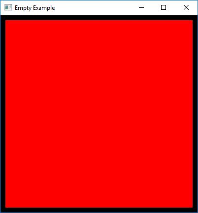

# Example: Empty

The purpose of this example is to show how to create a simple graphical window. The code will also print out any input events that will occur.

**Requires finegraphics and finemath module to run**

[import, lang:"c_cpp"](../../examples/graphics/empty.cpp)