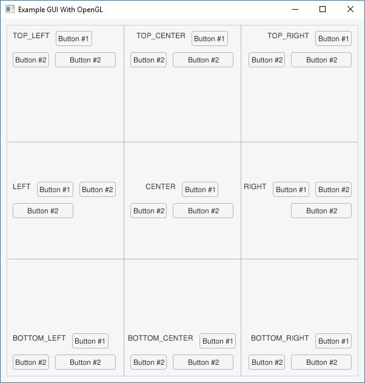
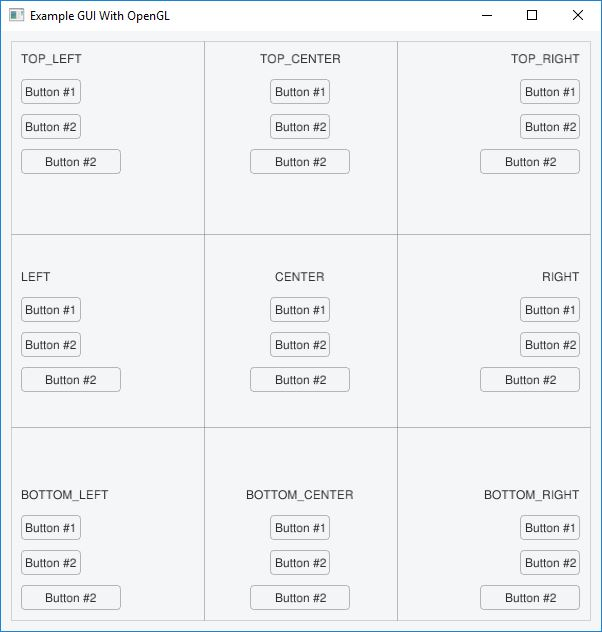

# Example: Gui All Widgets

_3x3 grid with horizontal orientation_

_3x3 grid with vertical orientation_

The purpose of this example is to show possibility of aligning widgets into: top-left, top-center, top-right, left, center, right, bottom-left, bottom-right, and bottom-center. This example uses OpenGL as an backend engine. The ffw::GuiWindowOpenGL class is provided for the user but **has to be manually included as `#include <ffw/gui/guiwindowopengl.h>` after importing graphics module.** The user is free to choose any backend they wishes to use. To implement one, follow ffw::GuiBackend and ffw::GuiWindowOpenGL documentation.

**Requires finegraphics, finegui, and finemath module to run**

[import, lang:"c_cpp"](../../examples/gui/guialign.cpp)