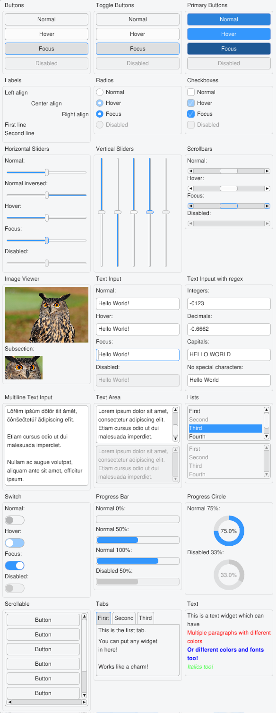
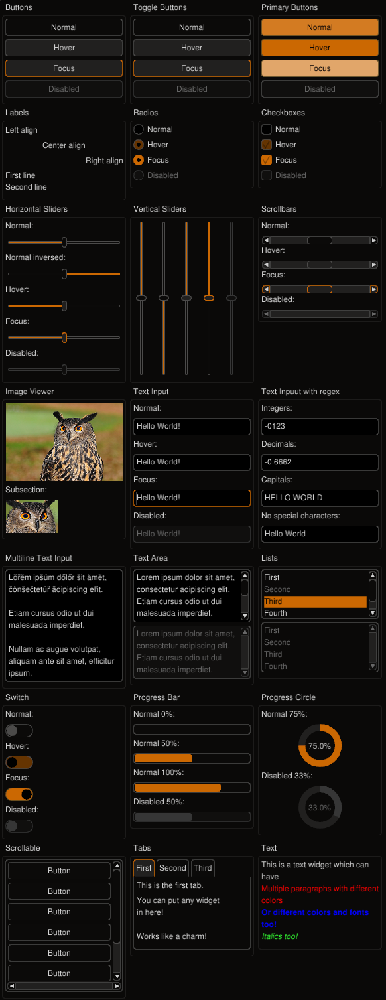
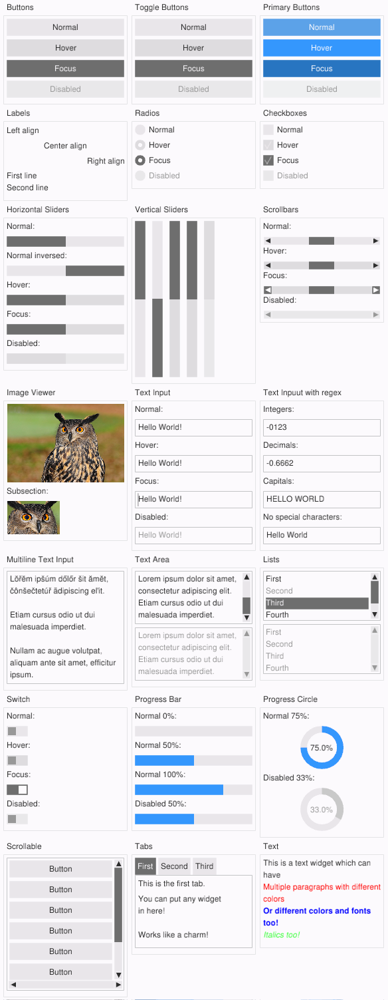
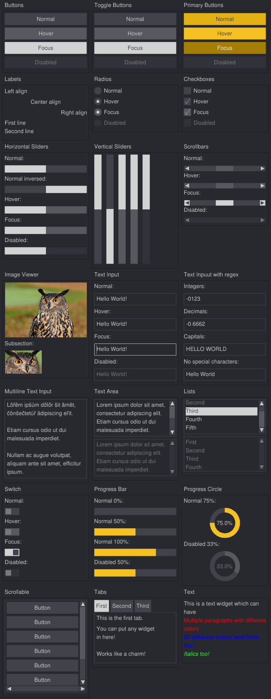

# Example: Gui Themes

The GUI widgets are all following stylistic design defined by ffw::GuiStyleGroup which are then grouped together by ffw::GuiTheme. The user is free to define they own theme, or edit pre-defined one. The following themes are defined in finegui:

**Simple Light:**

Can be enabled by `gui.setTheme(&ffw::GuiThemeSimpleLight::singleton);` where `gui` is instance of ffw::GuiWindow

**Simple Dark, exactly same as Simple Light, except all colors are inverted:**

Can be enabled by `gui.setTheme(&ffw::GuiThemeSimpleDark::singleton);` where `gui` is instance of ffw::GuiWindow

**Flat light theme:**

Can be enabled by `gui.setTheme(&ffw::GuiThemeFlatLight::singleton);` where `gui` is instance of ffw::GuiWindow

**Flat dark theme:**

Can be enabled by `gui.setTheme(&ffw::GuiThemeFlatDark::singleton);` where `gui` is instance of ffw::GuiWindow

