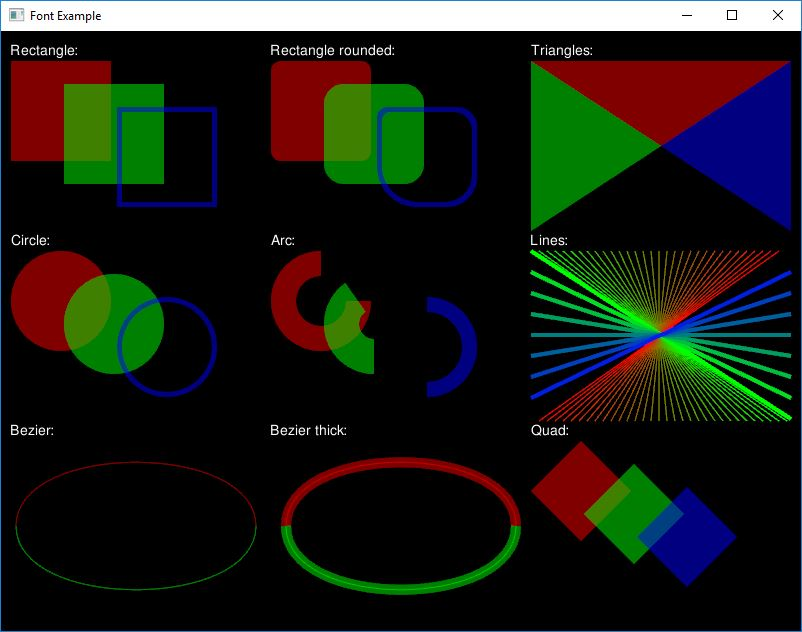

# Example: Shapes

The purpose of this example is to show various 2D primitives included in graphics module.

**Requires finegraphics and finemath module to run**

[import, lang:"c_cpp"](../../examples/graphics/shapes.cpp)