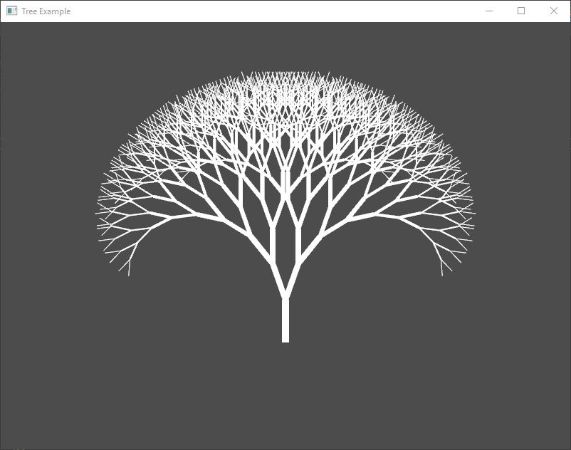

# Example: Tree

The purpose of this example is to show how simple is to draw 2D primitives and how to use vectors.

**Requires finegraphics and finemath module to run**

[import, lang:"c_cpp"](../../examples/graphics/tree.cpp)