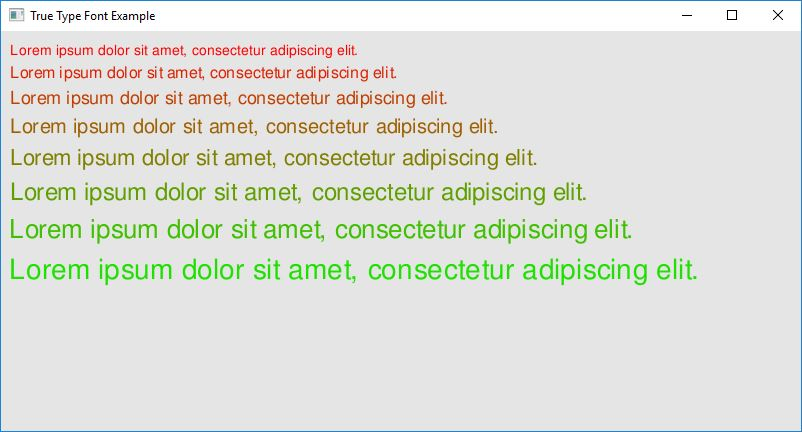

# Example: True Type Font

The purpose of this example is to show capability of loading and rendering a True Type based font. The code below should be simple enough to understand. Similary to [Bitmap Font](bitmap-font.html), this example uses True Type fonts instead of an image.

**Requires finegraphics and finemath module to run**

[import, lang:"c_cpp"](../../examples/graphics/truetypefont.cpp)